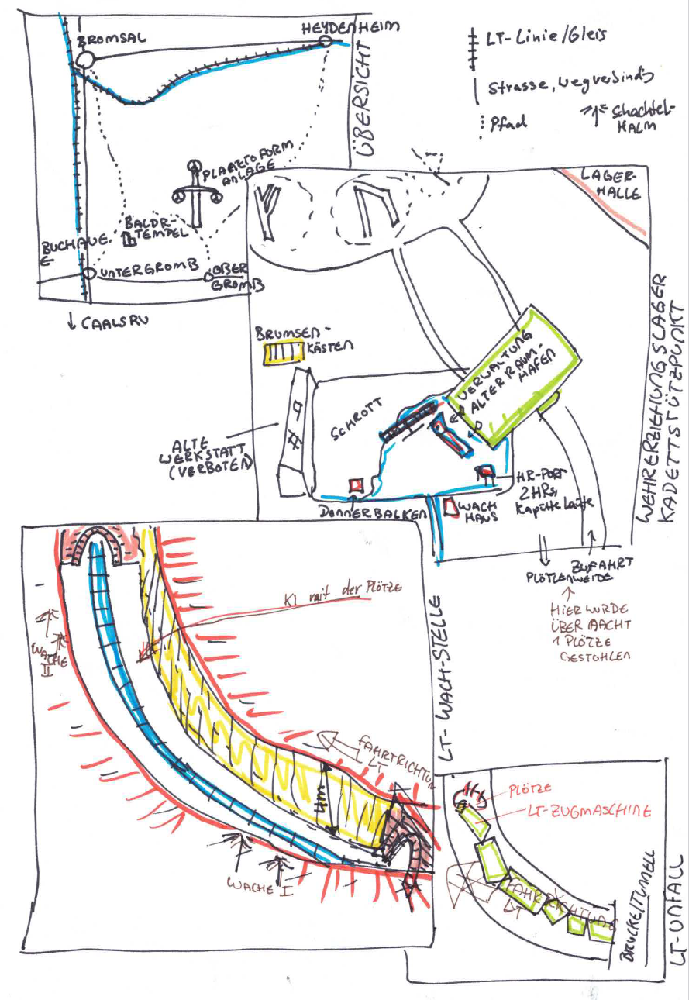

# Bewachung des Last-Transports (LT):

## Abenteuer - Walk-through

**You meet in a Stabscontainer**

* Morgens: Besprechung in Stabscontainer, Stabskadettin Heinlein brieft:
  * Transport von Viehwägen mit Plötzen
  * Überwachung eines Teilabschnitts des LT-Gleise
  * 2 Gruppen, jede mit einem Funker, Funkgerät bitte abholen
* Geraffel: die Charaktere holen ihre Ausrüstung, Funkgerät mitnehmen
* Gerücht: Plötze wurde von Weide des Bauern Krop gestohlen

**Auftrag – Ausführung**

**Positionierung**

* laufen zum Tunnel-frei-Abschnitt, Wach-Positionen einnehmen
* Miniabenteuer: Geräusche (Flittermolche); Gallertkrabbe zwickt durch Anzug (Flicken); Geräusch: Ausprusten einer
  Plötze, es riecht nach Brom

**LT-Unfall: Geräusche im Tunnel, LT kommt**

* Bewegungen andere Seite des Tunnelgrabens: eine Plötze stürzt sich in den Tunnel (IN-Probe: eine Blotzmann-KI ist
  sichtbar, sie reitet die Plötze)
* LT-Unfall: LT braust in die Plötze, entgleist, schwerer Unfall

**Befreiung und Flucht der KI**

* keine Plötzen im Zug, sondern KIs, die deportiert werden sollen
* Boltzmann öffnet die Tore
* Flucht durch den Tunnel
* Eingreifen der Soldaten, Gemetzel

**Verfolgung**

* eine kleine Gruppe an KI kann dennoch flüchten, durch Tunnel (Flittermolche, Leuchtglobus) oder oberirdisch (können
  sich von HR mitnehmen lassen)
* KI flüchten nach Süden auf den Berg zur Planetoformanlage und wird eingelassen „Wir sind Heim“

**Abschluss**

* Heinlein lobt den Einsatz, danke, dass ihr euren Auftrag ausgeführt habt!

## Karte

## Legende der Karte

**1. Exerzierplatz**

Ein staubiger, ockerfarbener Platz mit aufgesprungenem Boden. Weiße Kreidelinien markieren Marschwege. Rote Fähnchen
flattern an krummen Metallpfählen. In der Ferne glühen rostige Lautsprecher im grellen Sonnenlicht.

**2. Modularfaust mit Nachtigallerator (HR-Port)**

Graublauer Kuppelbau mit leuchtenden Sensorstreifen in Orange. Der Nachtigallerator brummt leise – wie ein schnarchender
Vogel. Zwei Hebrobotos stehen am Port:

* Klein & Neu: mattweiß mit blauen Lichtaugen.
* Groß & Alt: rostrot, wuchtig, mit abgeplatztem Lack und einem langsam mahlenden Arm.

**3. Stabscontainer & Schrottfeld**

Der Stabscontainer ist olivgrün, mit einer grellgelben Tür und Funkantenne. Daneben: das Schrottfeld. Alte
Raumschiffteile liegen unter der roten Marskruste wie Knochen. Vieles glitzert silbern oder ist mit lila Rost
überzogen – Relikte vom alten Raumhafen.

**4. Wachhäuschen**

Ein kleiner, würfelförmiger Posten aus sandfarbenem Komposit. Innen blinkt ein grünes Display. Außen hängt eine
zerschlissene Flagge. Ein übergroßer Helm liegt auf der Fensterbank – wohl vergessen.

**5. Landeplatz des alten Raumhafens**

Graubraune Betonplatten mit ausgebleichten Futhark-Zeichen, die unter dem Staub hervorblitzen. Zwischen den Rissen
summen die Brumsenstöcke – dunkelviolett-glänzende Bienenröhren mit wächsernen Ringen, aus denen warmer Duft aufsteigt.

**6. Verwaltungsgebäude**

Reinweißer Blockbau mit spiegelnden Fenstern und blauen Leuchtstreifen. Zwei echte Soldaten stehen davor – grün-grau
uniformiert, mit goldenen Rangabzeichen. Das Gebäude strahlt Ordnung, aber auch Angst aus.

**7. Lagerhalle des alten Raumhafens**

Breite Halle mit rostigen Wänden, die im Sonnenlicht orange schimmern. Drinnen stehen nur noch drei Container:

– Einer enthält vergilbte Marskarten und zerknickte Raumanzüge
– Einer ist mit Werkzeugresten und Stuhlteilen gefüllt
– Der dritte ist verschlossen, mit einem alten Symbol in Silber und Schwarz

**8. Hof von Krop Orbs Eltern**

Ein aus Blechteilen zusammengeschweißter Bauernhof mit rötlicher Schutzlackierung. Im Hof wachsen Marswurzeln aus
künstlich bewässerten Rillen. Über allem liegt ein bronzefarbener Solarschirm. Ein Generator surrt freundlich.

**9. Hof von Brul Eryns Eltern**

Hellgelber Anbau an einem alten Frachtcontainer. In den Fenstern hängen blaue Tücher. Zwei klapprige Drohnen kreisen
über kleinen Tiergehegen aus Netzstoff. Die Erde hier ist heller, fast sandweiß – ungewöhnlich für die Gegend.

**10. Plötzenweide**

Ein flacher Krater mit grün-grauen Futterstreifen. Die Plötzn sind plump und kuhartig, mit schimmernden Häuten in
Violett, Beige oder Hellblau. Ihr Sekret tropft in tiefe Auffangschalen aus gebürstetem Stahl. In der Ferne stehen
Windtürme, die surren wie Insekten.

**11. Tunnelgraben**

Unten verlaufen die Gleise, die Tunnel/Graben-Wände sind zugewuchert, man kann daran herunter- und raufklettern; das
Gleisbett betseht aus Gallertsteinen

**12. Tunnel**

Dunkel, dort leben Flittermolche und Gallertkrabben, es gibt zwei Leuchtglobusse an der Decke, der Weg ist holprig; bei
einem Sturz kann der Anzug

## Personae

**1. Stabskadettin Heinlein**

* Hobby: Alte Märchen über die Erde sammeln und nachspielen
* Geheimnis: Ihre Oma war früher eine berühmte Geschichtenerzählerin – doch ihre Bücher sind verboten
* Quest: Im Lagerarchiv eine versteckte Kiste mit den letzten Geschichten ihrer Oma finden – und retten, bevor der Inspektor kommt

**2. Kommandantin Solan**

* Rolle: Lagerleitung / Disziplin / Taktische Planung
* Funktion: Hat das letzte Wort im Lager. Führt mit klarem Blick und harter Stimme.
* Persönlichkeit: Kühl, strategisch, charismatisch. Kein Platz für Schwäche – aber gerecht.
* Hobby: Alte Märchen über die Erde sammeln und nachspielen
* Geheimnis: Ihre Oma war früher eine berühmte Geschichtenerzählerin – doch ihre Bücher sind verboten
* Quest: Im Lagerarchiv eine versteckte Kiste mit den letzten Geschichten ihrer Oma finden – und retten, bevor der Inspektor kommt

**3. Furiemeister Kelv**

* Rolle: Körperliche Ausbildung / Drill / Strafen
* Funktion: Zuständig für Ausdauertraining, Nahkampf und Lagerordnung.
* Persönlichkeit: Laut, unnachgiebig, hat immer einen Spruch auf den Lippen.
* Hobby: Miniaturmodelle von Marsfahrzeugen bauen und lackieren
* Geheimnis: Hat einen kleinen Bruder im Waisenhaus, den er heimlich besucht
* Quest: Genug Ersatzteile und Farben auftreiben, um dem Bruder ein funktionsfähiges Mini-Fahrzeug zu bauen – als Geburtstagsgeschenk

**4. Wachhabende Veyra**

* Rolle: Sicherheit / Nachtwache / Maschinenkontrolle
* Funktion: Kontrolliert Zugänge, kontrolliert Maschinen, beobachtet Kadetten heimlich
* Persönlichkeit: Still, fokussiert, fast schon unheimlich ruhig
* Hobby: Marskäfer beobachten und in einem Skizzenbuch festhalten
* Geheimnis: Ihre große Schwester wurde „versetzt“ – in Wahrheit versteckt sie sich in einem alten Versorgungstunnel
* Quest: Eine alte Taschenlampe und Batterien besorgen, um heimlich einen sicheren Weg zur Schwester zu finden – und sie mit Essen zu versorgen

**5. Ausbilderin Fenn**

* Rolle: Überlebenstraining / Geländeübungen / Notfallausbildung
* Funktion: Bringt den Kadetten bei, wie man im Ödland überlebt
* Persönlichkeit: Zäh, mitfühlend, heimlich rebellisch
* Hobby: Backt seltsame Kekse aus Marswurzeln und gibt ihnen Namen wie „Staubmuffin“
* Geheimnis: Ihr Cousin ist ein „langsamer Lerner“ – und soll in ein Speziallager kommen
* Quest: In die Lagerverwaltung schleichen, um seinen Bericht zu ändern – bevor der Transporter kommt

## Kadettrollen – die Gegengruppe

**1. Jaro – Späher**

* Aufgabe: Kundschaften, Wege erkunden, Feinde oder Gefahren frühzeitig entdecken
* Typ: Wachsam, neugierig, oft ungeduldig
* Konfliktpotenzial: Neigt dazu, Regeln zu ignorieren und auf eigene Faust loszuziehen.

**2. Mira – Schildträgerin**

* Aufgabe: Beschützt schwächere Kameraden, hält die Gruppe zusammen, oft in vorderster Linie
* Typ: Loyal, mutig, etwas stur
* Konfliktpotenzial: Stellt sich selbst oft zu sehr in Gefahr, will niemanden enttäuschen.

**3. Eli – Signalgeber**

* Aufgabe: Gibt mit Flaggen, Pfeifen, Licht etc. Signale, hält Verbindung zur Basis
* Typ: Klug, ruhig, kommunikativ
* Konfliktpotenzial: Hat Angst, im entscheidenden Moment die falsche Botschaft zu senden.

**4. Lleora - Quartiermeisterin (oder: "Versorgungskadettin")**

* Aufgabe: Kümmert sich um Ausrüstung, Rationen, Karten und Logistik
* Typ: Ordentlich, praktisch, leicht reizbar
* Konfliktpotenzial: Fühlt sich oft unterschätzt, obwohl ohne sie nichts funktioniert.

**5. Tomma – Feuerwart**

* Aufgabe: Hüter des Lagerfeuers, der Rituale, der Geschichten und der Disziplin
* Typ: Stolz, traditionsbewusst, manchmal zu ernst Konfliktpotenzial: Besteht auf Regeln, auch wenn Flexibilität gefragt
  wäre.

**6. Rika – Kartenleserin**

* Aufgabe: Verantwortlich für Navigation, Kartenkunde, Wegplanung
* Typ: Klug, detailverliebt, manchmal etwas besserwisserisch
* Konfliktpotenzial: Vertraut mehr auf Karten als auf Instinkt – was in der Wildnis nicht immer hilft.

**8. Linus – Lauscher**

* Aufgabe: Lauscht auf entfernte Geräusche, Feindbewegungen oder geheime Gespräche
* Typ: Still, aufmerksam, wirkt oft unbeteiligt – ist es aber nie.
