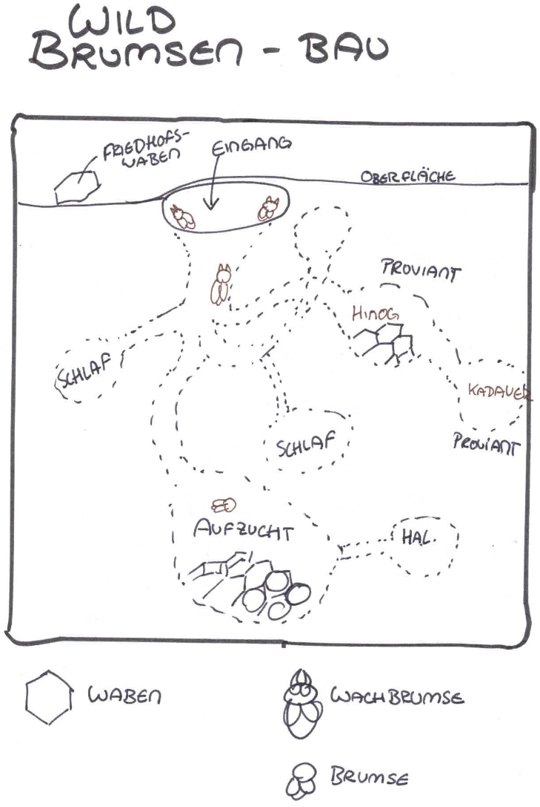

# Stimme aus der Stille – Nand 0.1

## Abenteuer

**You meet in a Stabscontainer,  Stabskadettin Heinlein, Briefing**

* Umzugshelfer für Granatenfertigung, Verlegung wg. Umbaus, keine Kisten aufmachen! könnte gefährlich sein, ᚠᚢᚦ
* Solan ist nicht da, sie trauert wegen ihrer Brumsen
* Runder kommt zu spät, sein Echsenschupp Schnuppi wartet vor dem Bullauge
* Proviantzelt-Chaos
    * Furiermeister Kelv schreit: das Proviantzelt ist voller ekliger Flittermolch-Larven
    * Abbruch Briefung, Kadetten werden geschickt, um das Proviantzelt zu säubern

**Auftrag: Umzug der Granatenfertigung + tragischer Unfall**

* Lagerhalle des Alten Raumhafens, groooos, mit Runen markierte Areale
* Kisten müssen von ᛞ Dagaz nach ᚾ Naudiz umgezogen werden, Motorsacke
* Probleme: Beladung, grooosem unhandluche Kiste, aufgebrochene Kiste
* Umgang mit Unfall
    * Runder war bei der Einweisung nicht da und wird sterben, weil er eine ᚦ-Kiste fallen lässt
    * Heinlein ist bestürzt, Abtransport Runder, Rest des Tages frei

**Runders Geheimnis**

* Schnuppi ist traurig, heult an der Motorsacke mit der Leiche (brrr)
* Schnuppi läuft weg zum Donnerbalen, ein Kadett muss folgen
* am Donnerbalken finden sie eine modifizierte Funkkiste, die Runder versteckt hat sowie einen Zettel mit der angabe einer Uhrzeit 2100 und einer Frequenz
* zu diesem Zeitpunkt meldet sich dann Hal, eine KI, sie braucht einen alten V5-Akku

**Hilfe für die KI Hal**

* V5-Akku besorgen: könnten irgendwo im Schrott sein, den müsste man mit den HRs beseitigen; oder Geraffelei
* Akku an Hal überreichen
    * Hal ist vergraben im Wildbrumsen-Bau im Schachtelhalm-Wald
    * Schnuppi kennt den Weg
    * Wachbrumsen mit Bromrauch lahmlegen
    * Halo möchte dortbleiben, weil sicher

**Modularfaust Basiskurs**

* Erklärung Modularfaust
* Nachtigallerator = Unsichtbarkeitsgenerator, ausbaubar (verboten!!!)
* Schussübungen
* erster Einsatz: Wildbrumsenbau soll vernichtet werden
* Wie schaffen es die Kadetten, Heinlein zu überzeugen, das NICHT zu tun, um Hal zu schützen, oder lassen Sie das einfach geschehen?
* Tipp: Kommandantin Solan zuhilfe holen, die LIEBT Brumsen und wir entsprechend vorgehen

**Abschluss**

* Heinlein lobt den Einsatz, danke, dass ihr euren Auftrag ausgeführt habt!

## Karte

### Bromsal und Umgebung

* **Bromsal**
    * mittelgrosse Stadt zwischen Freifahrt und Kruh
    * LastTransport-Gabelung
* **Eichberg** und "**Mildberg**
    * höhere Erhebung zwischen Bromsal und Untergromb
    * Mildberger Tempel auf Spitze des Mildbergs
* **XWel** - Wehrerziehungslager
* **Tunnel**
    * zwischen Bromsal und Haidenhain
    * dunkel
    * Flittermolche und Gallertkrabben
    * zwei Leuchtglobi an der Decke
    * der Weg ist holprig

### Wehrerziehungslager und Umgebung

* **Wehrerzieungslager**: grosses Gelände auf Teilen des ehemaligen Raumhafens
* **Bauernhöfe** (in südlicher Richtung)
    * Hof von Krop Orbs Eltern: Ein aus Blechteilen zusammengeschweißter Bauernhof mit rötlicher Schutzlackierung. Im Hof wachsen Marswurzeln aus künstlich bewässerten Rillen. Über allem liegt ein bronzefarbener Solarschirm. Ein Generator surrt freundlich.
    * Hof von Brul Eryns Eltern: Hellgelber Anbau an einem alten Frachtcontainer. In den Fenstern hängen blaue Tücher. Zwei klapprige Drohnen kreisen über kleinen Tiergehegen aus Netzstoff. Die Erde hier ist heller, fast sandweiß – ungewöhnlich für die Gegend.
* **Plötzenweide** (in südlicher Richtung): Ein flacher Krater mit grün-grauen Futterstreifen. Die Plötzen sind plump und kuhartig, mit schimmernden Häuten in Violett, Beige oder Hellblau. Ihr Sekret tropft in tiefe Auffangschalen aus gebürstetem Stahl. In der Ferne stehen Windtürme, die surren wie Insekten.

### Wehrerziehungslagers und Alter Raumhafen

* **Exerzierplatz**: Ein staubiger, ockerfarbener Platz mit aufgesprungenem Boden. Weiße Kreidelinien markieren Marschwege. Rote Fähnchen flattern an krummen Metallpfählen. In der Ferne glühen rostige Lautsprecher im grellen Sonnenlicht.
* **Modularfaust mit Nachtigallerator (HR-Port)**: Graublauer Kuppelbau mit leuchtenden Sensorstreifen in Orange. Der Nachtigallerator brummt leise – wie ein schnarchender Vogel. Zwei Hebrobotos stehen am Port:
    * Klein & Neu: mattweiß mit blauen Lichtaugen.
    * Groß & Alt: rostrot, wuchtig, mit abgeplatztem Lack und einem langsam mahlenden Arm.
* **Stabscontainer & Schrottfeld**: Der Stabscontainer ist ockerrot, mit einer grellgelben Tür und Funkantenne. Daneben: das Schrottfeld. Alte Raumschiffteile liegen unter der roten Marskruste wie Knochen. Vieles glitzert silbern oder ist mit lila Rost überzogen – Relikte vom alten Raumhafen.
* **Wachhäuschen**: Ein kleiner, würfelförmiger Posten aus sandfarbenem Komposit. Innen blinkt ein grünes Display. Außen hängt eine zerschlissene Flagge. Ein übergroßer Helm liegt auf der Fensterbank – wohl vergessen.
* **Landeplatz des alten Raumhafens**: Graubraune Betonplatten mit ausgebleichten Futhark-Zeichen, die unter dem Staub hervorblitzen. Zwischen den Rissen summen die Brumsenstöcke – dunkelviolett-glänzende Bienenröhren mit wächsernen Ringen, aus denen warmer Duft aufsteigt.
* **Verwaltungsgebäude**: Reinweißer Blockbau mit spiegelnden Fenstern und blauen Leuchtstreifen. Zwei echte Soldaten stehen davor – grün-grau uniformiert, mit goldenen Rangabzeichen. Das Gebäude strahlt Ordnung, aber auch Angst aus.
* **Lagerhalle des alten Raumhafens**: Breite Halle mit rostigen Wänden, die im Sonnenlicht orange schimmern. Drinnen stehen nur noch drei Container:
    * Einer enthält vergilbte Marskarten und zerknickte Raumanzüge
    * Einer ist mit Werkzeugresten und Stuhlteilen gefüllt
    * Der dritte ist verschlossen, mit einem alten Symbol in Silber und Schwarz

### Brumsenbau im Schachtelhalmwald

