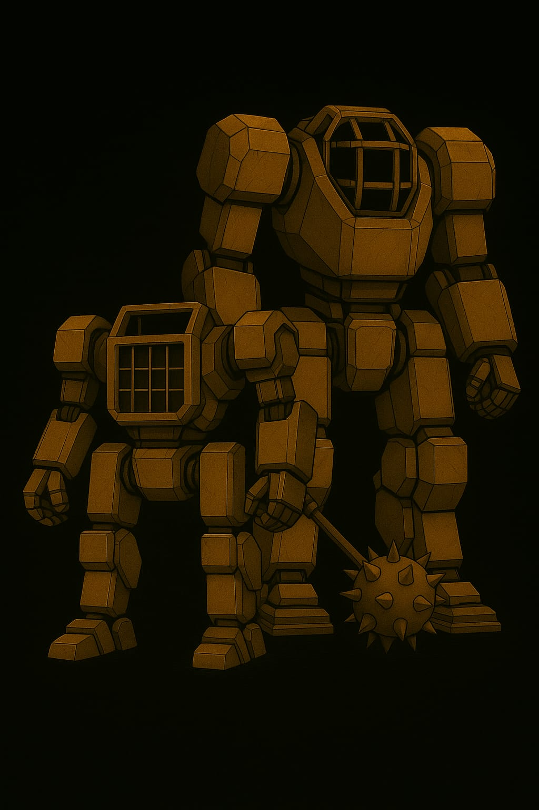
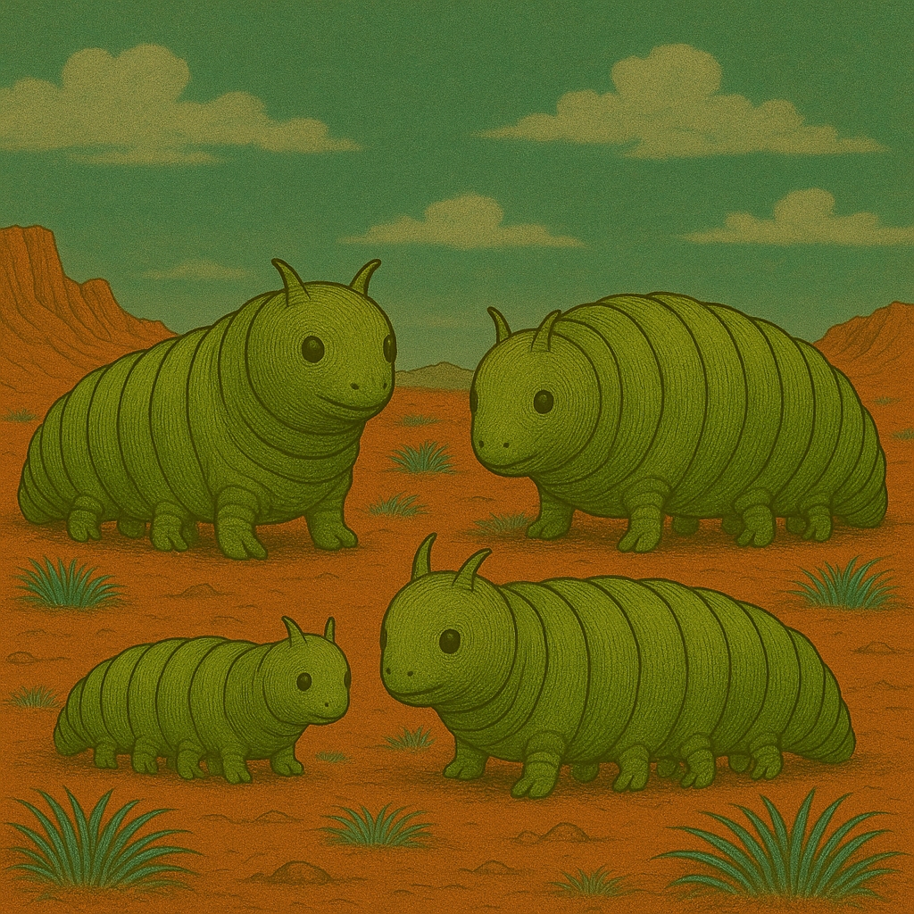

# Nand - Das Rollenspiel

> Der🌌 „Staubpfoten – Abenteuer auf dem Mars“ 🐾
> Ein inklusives Rollenspiel in einer rauen, roten Welt

Der Mars ist kein Ort für Schwache.
Aber Stärke hat viele Formen.

Weit über den staubigen Hügeln ragen die Planetoformanlagen wie metallene Giganten in den Himmel – uralte Maschinen,
betrieben von geheimnisvollen KIs, die mehr wissen, als sie sagen. Tief darunter leben die Marser – feline Wesen mit
wachen Augen, scharfen Krallen und weichen Herzen. Sie wachsen auf in Ausbildungslagern, arbeiten in Schrottfeldern,
lernen, sich zu behaupten, zu träumen … und zu kämpfen.

Du bist Teil einer Kadett*innenschaft.
Du hast Freunde. Hoffnungen. Schwächen.
Vielleicht fehlt dir ein Bein. Vielleicht sprichst du anders. Vielleicht träumst du von Dingen, die man dir verbieten
will.

Doch du bist nicht allein.
Und wenn du mutig bist, kannst du den Schleier lüften – über die KIs, das Grosse Schyff … und über das, was der Mars
einst war.

Staubpfoten ist ein erzählerisches Rollenspiel für Menschen jeden Alters.
Divers, barrierefrei gedacht, voller Geheimnisse, Herz und Kampfgeist.

## Mars, 2045. 2. Interplanetarischer Krieg.

Ja, Kacke … Krieg und Kindsein …

Ihr seid mittendrin. Mitglieder der MZ-Kadettschaft und zukünftige Soldaten! Okay, ihr seid erst 8 Winter alt, manche sogar 16. Aber man muss früh anfangen. Schliesslich wollen wir den Krieg gewinnen.
Daher viel Spass im Wehrerziehungslager und danach bei Eurem ersten richtigen Auftrag: der Observation der Mars-Kristallnacht. Ihr werdet den Marsianischen Zephir stolz machen!

===

Kleiner Tipp: Und schau zu, dass niemand mitbekommt, dass deine Schwester behindert ist. Sonst kommen sie sie holen … also verrate keinem dein Geheimnis.

===

Ihr schlüpft in die Rollen Marser Kinder. Marser sind Feline mit Fell, Schwarz und Schnurrhaaren. Erlebt ein wundervolles Abenteuer und macht die Welt es bisschen besser!

## Triggerwarnungen

* Ideologie
* Gruppenzwang
* Verrat
* Irrtum
* Ungerechtigkeit gegenüber Minderheiten
* Zweifel
* Ungewissheit
* Gewalt gegen alles Mögliche, was der Ideologie widerspricht

## Musik zur Einstimmung

<audio controls autoplay>
  <source src="_media/nand-echo.mp3" type="audio/mpeg">
Your browser does not support the audio element.
</audio>

## Fanart

### HR

``

### Brumsen

### Plötzen

