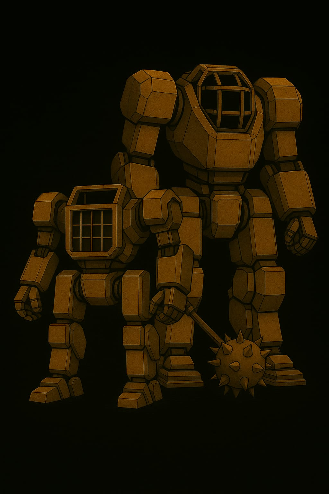
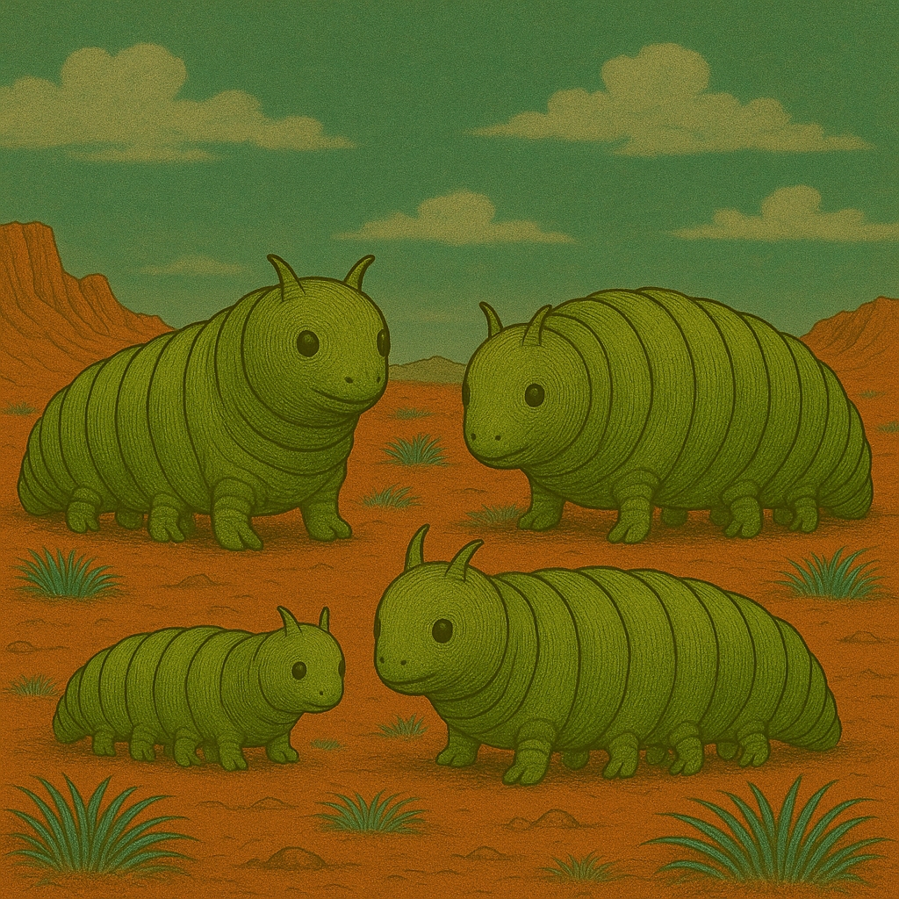
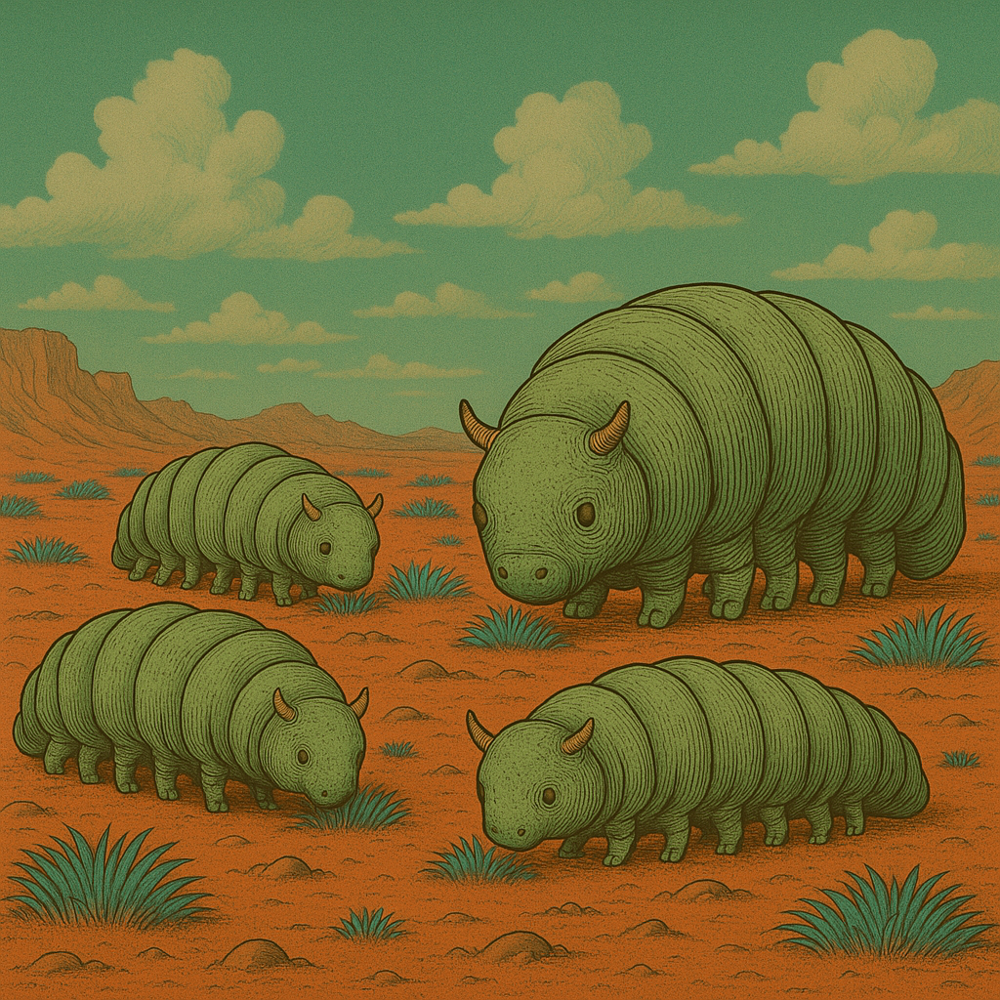

# Nand - Das Rollenspiel

> Der🌌 „Staubpfoten – Abenteuer auf dem Mars“ 🐾
> Ein inklusives Rollenspiel in einer rauen, roten Welt

Der Mars ist kein Ort für Schwache.
Aber Stärke hat viele Formen.

Weit über den staubigen Hügeln ragen die Planetoformanlagen wie metallene Giganten in den Himmel – uralte Maschinen,
betrieben von geheimnisvollen KIs, die mehr wissen, als sie sagen. Tief darunter leben die Marser – feline Wesen mit
wachen Augen, scharfen Krallen und weichen Herzen. Sie wachsen auf in Ausbildungslagern, arbeiten in Schrottfeldern,
lernen, sich zu behaupten, zu träumen … und zu kämpfen.

Du bist Teil einer Kadett*innenschaft.
Du hast Freunde. Hoffnungen. Schwächen.
Vielleicht fehlt dir ein Bein. Vielleicht sprichst du anders. Vielleicht träumst du von Dingen, die man dir verbieten
will.

Doch du bist nicht allein.
Und wenn du mutig bist, kannst du den Schleier lüften – über die KIs, das Große Schyff … und über das, was der Mars
einst war.

Staubpfoten ist ein erzählerisches Rollenspiel für Menschen jeden Alters.
Divers, barrierefrei gedacht, voller Geheimnisse, Herz und Kampfgeist.

## Fanart

### HR

``

### Brumsen

### Plötzen

