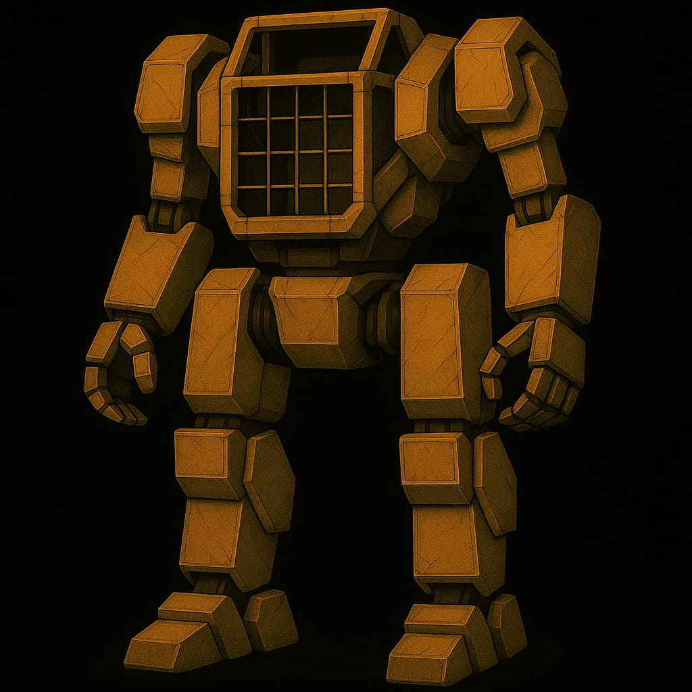
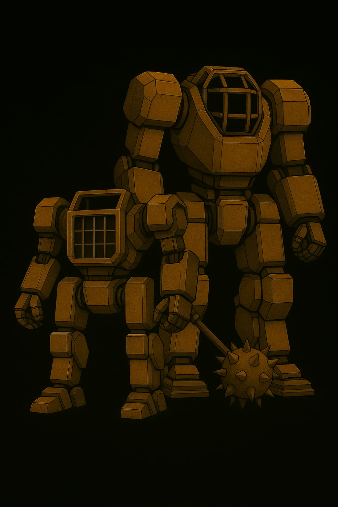
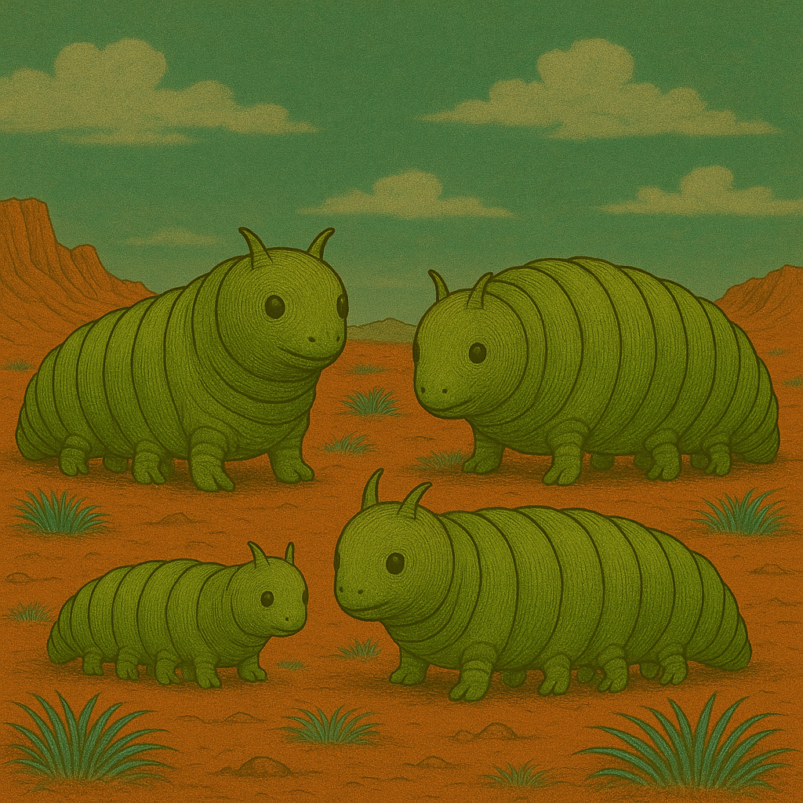
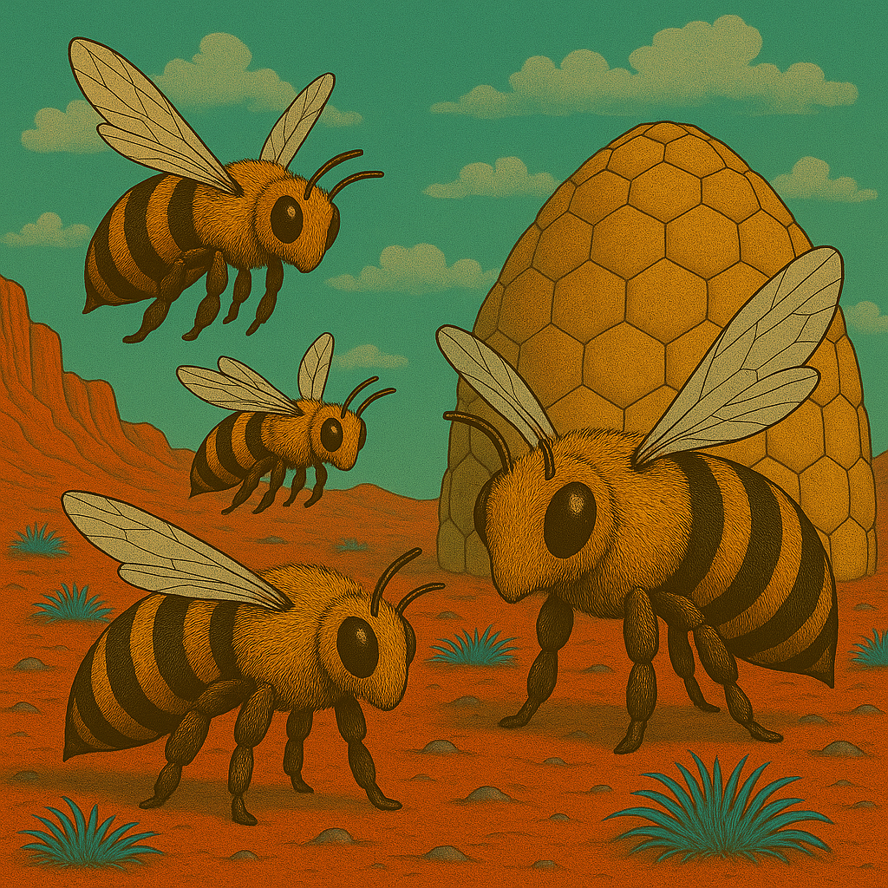
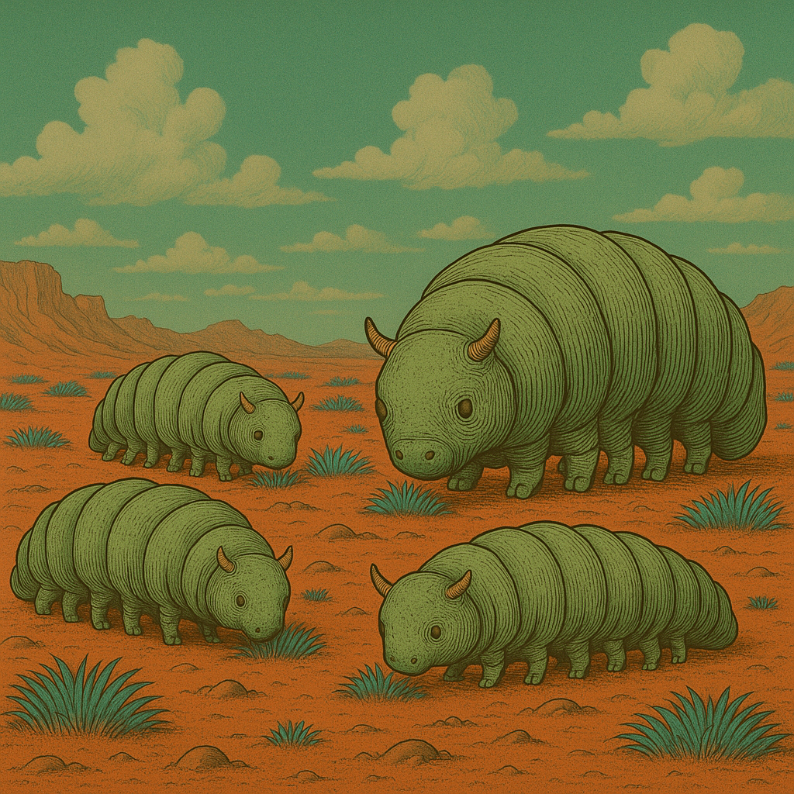

⁰# Die Pfoten voller Staub

> Nand - Das Rollenspiel

## Darum geht's

Hab Spass auf dem Mars! Erlebe Gefahrem und Abenteuer! Und wie weit wirst du gehen, um den Mars zu retten?

### Auf einen Blick

1. Du bist eine Katze auf zwei Beinen.
2. Du lebst auf dem Mars. Die Atmosphäre des Mars ist giftig und darum brauchst du einen Schutzanzug.
3. Der Marsianische Zephir herrscht über den Mars. Er ist wahnsinning und hat einen Krieg angezettelt.
4. Du bist zwangsweise Mitglied in der Kadettschaft. Dort sollst du zu einem ordentlichen, wehrfähigen Soldaten erzogen werden.
5. Irgendwann merkst du, dass das alles irgendwie gar kein Spiel ist. Was wirst du tun?

### Spielwelt

Die Handlung spielt auf dem Mars, in einer nahen Dimension. Du bist ein Feliner, der auf dem Mars lebt; also eine Katze auf zwei Beinen im Schutzanzug.

Der Mars steht kurz vor dem Krieg beziehungsweise es ist schon Krieg. Und du bist Mitglied der sogenannten MZ-Kadettschaft, einer paramilitärische Gruppierung zum Heranziehen von Soldaten.

Und das heisst Spass. Nachmittägliche Gruppenstunden, mehrtägige Wehrertüchtigungslager, HR-Führerschein! Besonders toll ist, dass ihr bald richtige Aufträge bekommt. Zum Beispiel KI überwachen oder gleich selbst zu plasmieren. 

Nieder mit den KI!

(Oder auch nicht!)

## Besonderheit

Jeder Charakter hat eine eigene Behinderung oder **Einschränkung** – **körperlich oder geistig**. Dies ist nicht nur ein Merkmal, sondern beeinflusst Spielweise, Entscheidungen und Lösungen. 

## Mars, 2045

Die unendliche Weite des Horizonts. Überspannt vom sanft grünen Himmel.  Der Sand und all die verschiedenen Farbtöne des Sands. Ocker. Ziegel. Dunkel. Braun. Bromig. Hier bist du geboren. Auf dem Mars.

Es riecht nach Brom. Denn dein Filter ist alt. Du solltest ihn schon länger ersetzt haben. Das Brom ist bitter ... und ätzend.

## Kadettschaft - Kameradschaft

Ja, Kacke ... Krieg und Kindsein ... 

Ihr seid mittendrin. Mitglieder der MZ-Kadettschaft und zukünftige Soldaten! Okay, ihr seid erst 8 Winter alt, manche sogar 16. Aber man muss früh anfangen. Schliesslich wollen wir den Krieg gewinnen.
Daher viel Spass im Wehrerziehungslager und danach bei Eurem ersten richtigen Auftrag: der Observation der Mars-Kristallnacht. Ihr werdet den Marsianischen Zephir stolz machen!

===

Kleiner Tipp: Und schau zu, dass niemand mitbekommt, dass deine Schwester behindert ist. Sonst kommen sie sie holen ... also verrate keinem dein Geheimnis.

===

Ihr schlüpft in die Rollen Marser Kinder. Marser sind Feline mit Fell, Schwarz und Schnurrhaaren. Erlebt ein wundervolles Abenteuer und macht die Welt es bisschen besser!

### Hintergrund

Die Grundstimmung und viele Themen basieren auf den Kriegserlebnissen von Ferdinand Riegel, dem Vater der Autorin des Buches "Ich bin Nand" sowie dieses Rollenspiels. Seine Erfahrungen und Erkenntnisde aus dem 2. Weltkrieg geben dem Spiel eine ehrliche, emotionale Tiefe.

Nicht zuletzt hast du in diesem Rollenspiel die Chance, kleine Fluchten und Rettungen zu ermöglichen. Denn hier wie im richtigen Leben gilt: Die Welt immer ein bisschen besser machen. Und Entscheidungen treffen, die damals getroffen hätten werden sollen.

## Triggerwarnungen

* Ideologie
* Gruppenzwang
* Verrat
* Irrtum
* Tod
* Body-Horrer / Missgestaltung des Körpers
* Ungerechtigkeit gegenüber Minderheiten
* Zweifel
* Ungewissheit
* Gewalt gegen alles Mögliche, was der Ideologie widerspricht

## Disclaimer

### Erklärung zum Spielsystem und seiner historischen Einordnung

Dieses Spielsystem wurde mit einem klaren Ziel entwickelt: Aufklärung durch kritische Auseinandersetzung. Die darin enthaltenen Elemente diktatorischer Systeme – etwa Kontrolle, Propaganda, Gehorsam oder Gewaltmonopol – sollen nicht ästhetisiert oder romantisiert, sondern offengelegt und hinterfragt werden.

Gerade in Zeiten, in denen demokratische Werte wieder unter Druck geraten, halten wir es für notwendig, auch über spielerische Mechaniken zu vermitteln, wie gefährlich totalitäre Ideologien sind.

Unser Spielsystem verherrlicht in keiner Weise die Greueltaten oder Ideologien des Dritten Reichs. Im Gegenteil: Wir verfolgen mit diesem System einen klar aufklärerischen Ansatz. Ziel ist es, insbesondere jungen Menschen auf eindringliche Weise bewusst zu machen, wie gefährlich diktatorische Systeme wie jenes des Nationalsozialismus sein können.

Dabei sehen wir unser Spiel in einer ähnlichen Tradition wie der Roman "Starship Troopers" von Robert Heinlein, der häufig missverstanden wird, tatsächlich jedoch zur kritischen Auseinandersetzung mit autoritären Gesellschaftsformen einlädt.

Ergänzend dazu: Der besondere Wert unseres Ansatzes liegt in der Verbindung von spielerischem Zugang und historischer Sensibilisierung. Diese Herangehensweise hat viele Teilnehmer beeindruckt – sie macht Geschichte erlebbar, ohne sie zu trivialisieren.

### Diversität

Dieses Rollenspiel wurde über mehrere Treffen am Rollenspieltreff des Rollenspielvereins Freiburg angeboten. Die Rückmeldung war durchweg positiv.

Dieses Rollenspiel ist divers, nicht nur in Bezug auf `[AKTUELL_POLITISCH_KORREKTE_BEZEICHNUNG_FUER_LGBTQIA+]`-Community, sondern vor allem in Bezug auf Inklusion von Behinderten.

Jeder Charakter hat Behinderungen, Einschränkungen, psychische Probleme - so wie wir alle.

Was ist das Schöne daran? Du kannst dir deine Behinderung aussuchen!

* Nicht-Behinderte: Erfahrungen sammeln. Dass man eben nicht mal jemandem hinterherrufen kann. Weil man eben nicht sprechen kann. Oder dass man nicht mal jemandem Bescheid geben kann, weil man massiv unter sozialen Ängsten leidet.
* Behinderte: Erfahrungen als Anders-Behinderter sammeln und einfach Spass haben.

### Spiel-Erfahrungen

Im monatlichen Rollenspielteff des Rollenspielvereins Freiburg habe ich dieses System / Rollenspiel mehrmals  angeboten. Die Rückmeldungen waren durchweg positiv.

Hier einige Reaktionen und Situationen, die sich am Spieltisch ergeben haben:

* Diskussionen über das 3. Reich
* Rekapitulation des 3. Reichs und der Propaganda-Struktur. U. a. mit Schülerin, die dieses Thema gerade im gesamten Schuljahr in verschiedenen Unterrichtsfächern beleuchten durfte.
* Ganz süss, zwei Spieler*innen (mit Behinderungen) waren entzückt: "Schau mal, wir können uns unsere Behinderungen aussuchen!!"
* Erfahrungen im Mitläufertum: hilflose und schliesslich plasmierte KI; aus purem Eigennutz vernichtet (da war selbst ich als Meister baff). Empörung der Mitstreiterin: "Wir gründen eine Weisse Rose" (zur Rettung der KI)

## Ambience Sound zu Mars, Krieg und Raumschiff

<audio controls autoplay>
  <source src="_media/nand-echo.mp3" type="audio/mpeg">
  Your browser does not support the audio element.
</audio>

## Fanart

### HR

``

### Brumsen

### Plötzen

