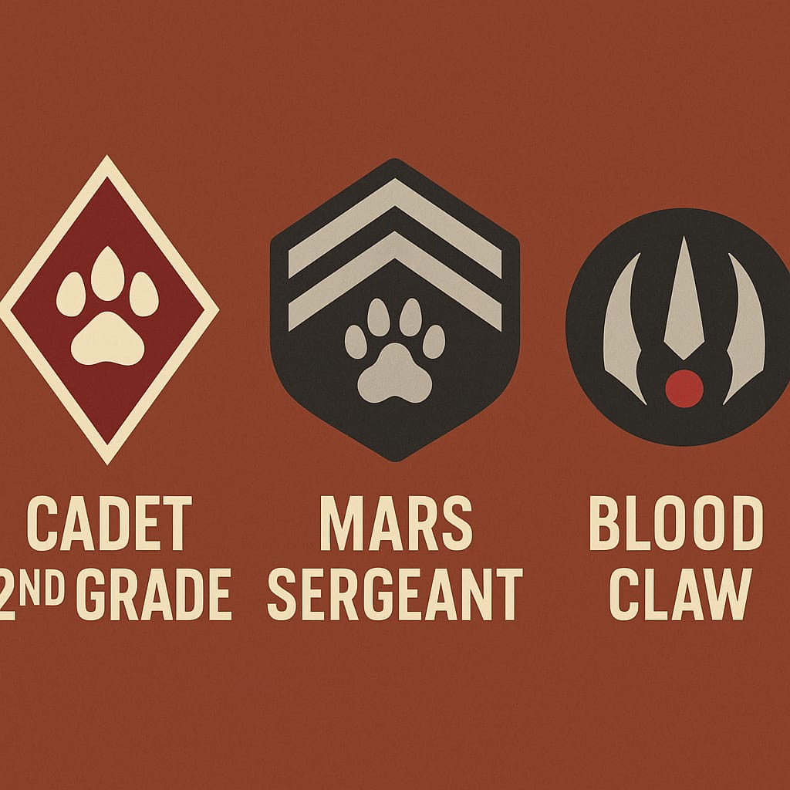
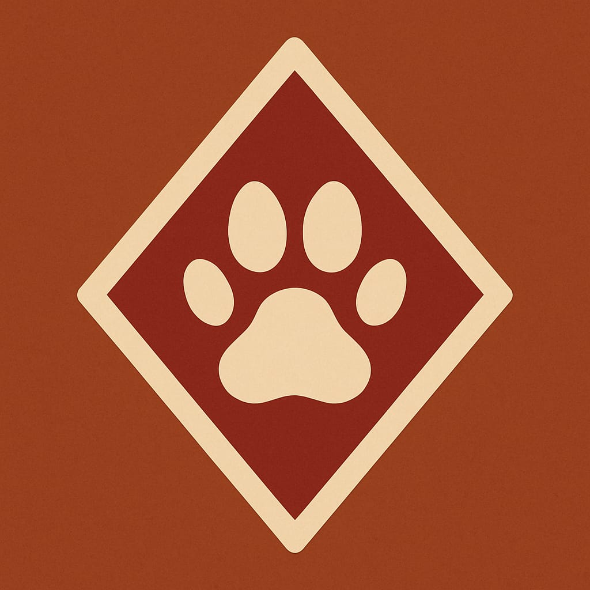

# Dienstgradabzeichen der Marskadetten – Klares Rauten-System

## K-1 — Kadettanwärter ("Pfotenling")

* Symbolik: Eine einzelne, weisse Katzenpfote ohne weitere Elemente
* Form: Kein Rahmen, keine Raute, nur der Pfotenabdruck mittig
* Farbgebung: Pfote weiss, Hintergrund in Uniformfarbe (rostrot, ockerbraun, etc.)
* Bedeutung: Der erste Schritt. Noch ungeschützt, noch ungeformt – reine Bereitschaft zur Ausbildung.
* Pfote: naturgetreu, weich gerundet, zentral platziert
* Besonderheit: Das einzige Abzeichen ohne geometrische Form

## K-2 — Kadett 1. Stufe ("Staubpfote")

* Symbolik: Eine weisse Pfote innerhalb einer weissen Raute
* Form:
    * Pfote zentral
    * Weisse Raute umgibt die Pfote direkt, enger Rahmen
* Farbgebung: Hintergrund durchgehend Uniformfarbe, Raute und Pfote in Weiss
* Bedeutung: Beginn der Ausbildung – die äussere Struktur formt sich, erste Disziplin
* Pfote: bleibt identisch zu K-1

## K-3 — Kadett 2. Stufe ("Schwanzträger")

* Symbolik: Eine weisse Pfote innerhalb zweier ineinander liegender weisser Rauten
* Form:
    * Pfote zentral
    * Erste Raute: eng um die Pfote (wie bei K-2)
    * Zweite Raute: grösser, umgibt die erste mit einheitlichem Abstand (z. B. 1 Pfotenbreite)
* Beide Rauten sind gleichmässig proportioniert
* Farbgebung: Hintergrund bleibt gleich (Uniformfarbe), alle Linien und Pfote in Weiss
* Bedeutung: Schutz durch Struktur und äussere Ordnung – der Kadett beherrscht erste Prinzipien, wird gefestigt

## K-4 — Oberkadett ("Krallenpfote")

* Symbolik: Eine weisse Pfote in weisser Raute, umgeben von einer zweiten weissen Raute, aber der Hintergrund zwischen Pfote und äusserer Raute ist vollständig rot eingefärbt
* Form:
    * Wie K-3 (zwei Rauten)
    * Innenraum (Raute 1 bis Raute 2) ist rot gefüllt
* Farbgebung:
    * Pfote und beide Rauten weiss
    * Hintergrund ausserhalb der äusseren Raute bleibt Uniformfarbe
    * Innenfläche zwischen Pfote und äusserer Raute ist rot
* Bedeutung: Der Kadett ist vollständig geformt, bereit zum Übergang in regulären Dienst. Die rote Fläche symbolisiert Verantwortung und Einsatzbereitschaft

## 🔁 Einheitliche Merkmale:

* Alle Pfoten identisch gross und zentral platzier
* Alle Abzeichen auf durchgehendem Hintergrund in Uniformfarbe
* Geometrische Abgrenzung ausschliesslich über 0–2 Rauten und farbliche Fläche
