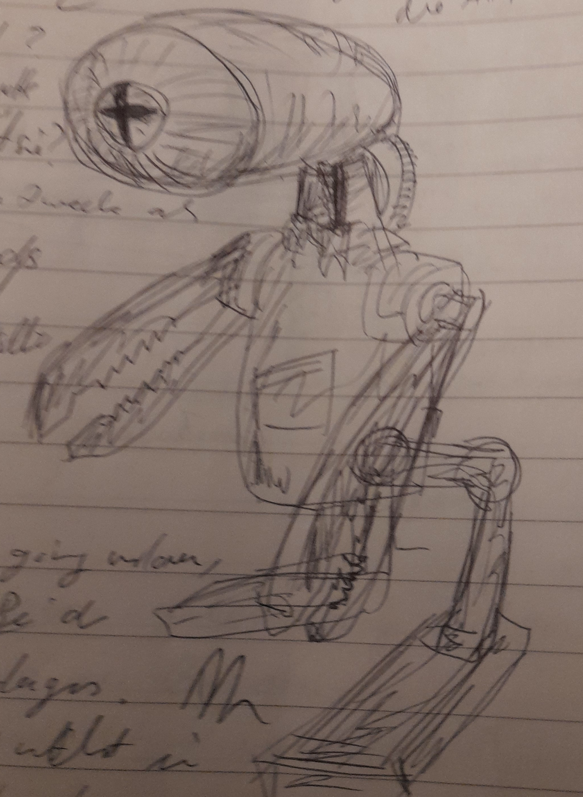

# AKI

Nand begegnet in der Mediathek einer kleinen Autonomen KI. Sie überreicht ihm einen Datenstock über Viviparie. Denn die Schyff-KI, die alle Datenströme sichtet, hat von Honeys Schwangerschaft erfahren. Leidet ist Nand nicht an dem Datenstock interessiert.

Sie ist von einer Planetoformanlage geflohen und versteckt sich dort. Nand hilft ihr dabei (?).

Nand könnte ihren Geochip entfernen und damit den Allempfänger bauen, nee geht zeitlich nicht ... es sei denn, er trifft die AKI früher schon ... genau, er erwähnt in einem Nebensatz, das er das fehlende Bauteil von einer kleinen KI ausgebaut habe.

Sie hilf ihm, weil sie dazu auf Basis der alten Robotergesetze verpflichtet ist.

* rettet sie bands runkelrübe
* wen  ja, wie
* wenn nand die rübe brinht, dan  muss nand vorher mitgeteilt haben, dass er brom braucht

## Vorkommen

* Mediathek
* kurz im Besucherraum, nachts
* nachts im Labor
* rettung der runkelrübe aus dem müllschredder?
* runkelrübendruck in helm
*  scheitern der übergabe der rübe

