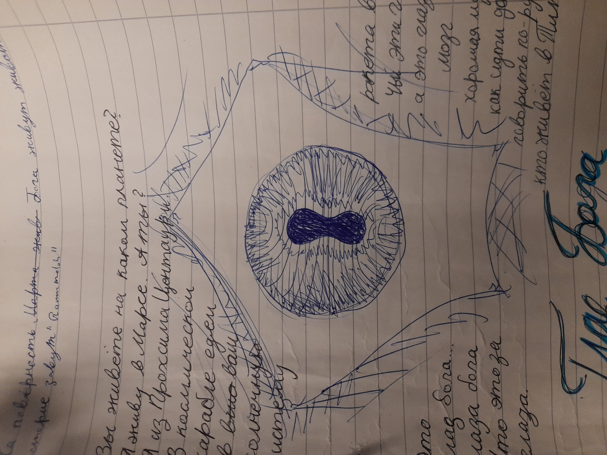

# Gott

Gott ist ein ausserirdisches Wesen aus aus einer anderen Dimension.
Durch einen Riss in der Wirklichkeit geraten Splitter oder Scherben Gottes in das Sonnensystem.
Anmerkung: Ein kleiner Riss entstand bei dem planetoformtechnischen Unfall bei Neith. Der heftigere Riss wurde durch eine Unwahrscheinlichkeitsbombe erzeugt und wieder geschlossen.

Diese Splitter verteilen sich im gesamten Sonnensystem.
Gott hat eine Affinität zu Brom, weshalb er bestrebt ist, auf dem Mars zu landen.
Ein Planet voller Brom, der Rote Planet genannt.

## Magische Kräfte

* Teleportation
* Zeitreisen
* Kraftquelle Yggdrasils
* Gegenwartsbrechung, Dreifinger haben drei Nornen

## Oberfläche Gottes

Ist voller Augen und voller Versprechungen, was mit dieser Macht anstellen kann.

## Scherbe Gottes

Die Scherbe liegt in einem Bromvorkommen. Es ist unklar, was die OG will.

* macht irre
* Gehirn ist verloren im All
* überträgt eine Krankheit / Raummolche / Kiemen
* überträgt Geisteskrankheit

## Gottesstaub

Entsteht bei der Planetoformung der Venus. Dreifinger haben ihn eingesanmelt.

## Interessenten

Jede Kraft oder Volk, welches verstanden hat, dass ein übermächtiges Wesen im Sonnensystem weilt, entwickelt eine ntürliche Gier, dieser Macht nahe zu sein bzw. diese zu besitzem. Jede Partei hat seine eigenen Intetesen und Vorstellungen zur Nutzung Gottes:

* Barben - Besiedelung, Baumschiff bauen
* KI - Verhinderung Heiliger Krieg, Assimilation Gottes, können nicht mit Gott in Verbindung treten, die Oberfläche Gottes ist für sie einfach nur leer
* Marser aka EK-Institut - Überlicht-Transporter
* Gotteskult - Heilige Welt
* Dreifinger - Philosophie, Sinn des Lebens, wollen Gott zerstören, aus Furcht vor Temporal-Schäden
* AKI - Verhinderung Heiliger Krieg, Hott uninteressant
* Raummolch - Brutplatz, Nahrung
* Titanen "die Hand Gottes fürchten"
* "die anderen (Splitter)"
* ...

## Zwischenfall mit der Probe

Es kommt zu einen noch nicht definierten Zwischenfall mit einer Probe Gottes. Dieser könnte Auswirkungen direkt auf Nand haben. Er kann aber weder das Ereignis nocv seine Gefühle richtig einordnen.

* Die Probe Gottes wird getötet?
* sie flieht?

# Begegnungen mit Gott

* Ginger und die Brombeeren - ist ds nich aktuell?
* was sagt die ki nand stattdessen?
