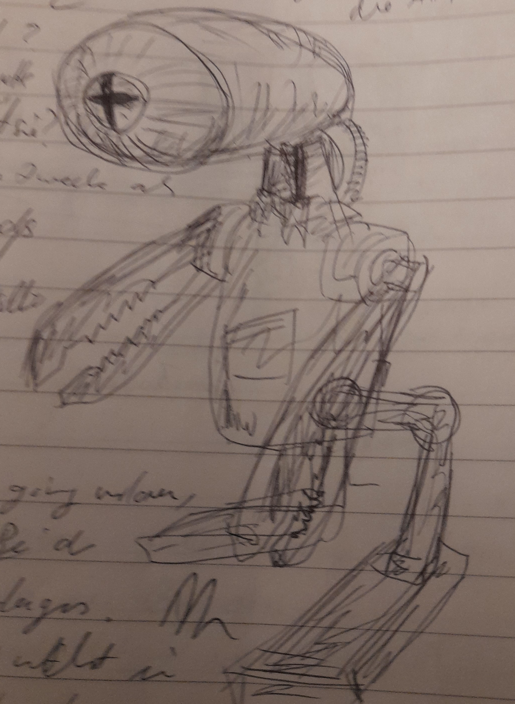
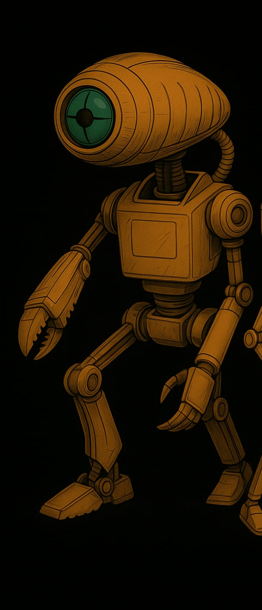

## KI

## Definition

Die KI ist eine künstliche Intelligenz. Von aussen betrachtet sind es einfach intelligente Roboter. Wie die Felinen
kamen sie mit dem Grossen Schyff auf den Mars. Nach der Landung übernahmen sie die AUfgabe, die Planetoformung
voranzutreiben und betrieben die grossen Planetoformanlagen.

Neben den "grossen" KI / Robotern gibt es auch kleine Autonome KIs.

Im ganzen gibt es folgende Ausformungen von KIs:

* intelligente Roboter mit Chip => ohne Persönlichkeit
* Körperformen
    * Service-KI
    * Vollfeline
    * Helferlein
    * Planetoform-KI, für spwzielle Aufgabe konzipiert
* die KI im Netz, verantwortlich für den Betrieb allerhand von Einrichtungen auf dem Mars
* AKI (Autonome KI) kleine Herlferlein, ungechipt, die sich verstecken, weil sie ohne Chip sind

## Geschichte

Wie die Felinen kamen die KI mit dem Grossen Schyff auf den Mars. Nach der Landung übernahmen sie die AUfgabe, die
Planetoformung voranzutreiben und betrieben die grossen Planetoformanlagen. Das ist ihre "Agenda".

Nach dem Niedergang der Unwahrscheinlichkeitsbombe waren die Planetoformanlagen überflüssig und damit die KI um ihre Agenda ärmer. Sie suchten sich andere Arbeiten, was zum Unmut unter den Marsern führte. Die Spannungen entladen sich
in Pogromen und der Einrichtung von Lagern ("Eden") im Zweiten Solaren Krieg.

Nach dem Krieg wird die Sicherheit der KIs über die Ersten Robotergesetze sichergestellt. Damit sind sie Marsischen
Bürgern gleichgestellt. Diese Zeit der Ruhe währt eine ganze Weile, bis 30 Jahre später, XYZ passiert, was den Hass
auf die KI erneut anfacht.

Wieder gibt es Pogrome und Aufstände - die Fanatiker selbst bezeichnen dies als den [Heiligen Krieg](/kraefte/ki/#was_passiert_im_heiligen_krieg) -, welche zu den Zweiten Robotergesetzen führt. Diese dienen nicht mehr der Sichrheit der KIs, sondern der Beschränkung ihrer Rechte.
Damit werden sie zu Nichtmarsern ohne Parsönlichkeitsrechte.

## KI – verschiedene Typen und Baureihen

### 1. Euler-4

* Typ: Schwerlast-Mechroboter
* Funktion: Transport & Verladearbeiten
* Beschreibung: Ein riesiger, hydraulischer Zweiarm-Mech mit verbeulter Panzerung, oft am alten Raumhafen im Einsatz.
  Kann Container heben wie Spielzeug.
* 🛠️ Spricht langsam, wirkt schläfrig – ist aber zäh wie Stahl.

### 2. Pi-KI (Modul)

* Typ: Verwaltungs-KI
* Funktion: Datenverarbeitung, Personalüberwachung
* Beschreibung: Unsichtbar, in Terminals und Lautsprechern aktiv. Verarbeitet Meldungen, Anträge und Verstöße.
* 👁️ Viele Kinder glauben, sie „weiß alles“ – ob das stimmt, ist unklar.

### 3. Planck-Drone

* Typ: Aufklärungsdrohne
* Funktion: Überwachung & Kartierung
* Beschreibung: Fliegende Drohne mit weiten Sensoraugen, summt wie eine große Mücke. Wird bei Geländeübungen eingesetzt.
* 🎯 Markiert Zielpersonen mit roten Laserpunkten – ohne Erklärung.

### 4. Tau-THUL

* Typ: Tunnelroboter
* Funktion: Wartung alter unterirdischer Anlagen
* Beschreibung: Ein krabbenartiger, achtbeiniger Roboter mit Greifarmen und Bohrmodul. Viele leben „halb wild“ im
  Schrottfeld.
* 💀 Einige Kadetten sagen, sie „fressen“ Dinge – und vielleicht auch mehr.

### 5. Phi-1

* Typ: KI-Hologuide
* Funktion: Erziehung, Schulung, Disziplinierung
* Beschreibung: Wirkt wie eine sanfte Frau mit Hologesicht. Gibt Unterricht, prüft und bewertet.
* 🎓 Wird oft ausgelacht – bis sie Strafpunkte verteilt.

### 6. Gamma Mk.6

* Typ: Vierbeiniger Suchroboter
* Funktion: Geländesicherung & Spurenverfolgung
* Beschreibung: Klein, flink, mit Antennenohren. Reagiert auf Marsgerüche und Vibrationen.
* 🐾 Kinder mögen ihn – wenn er nicht gerade Alarm schlägt.

### 7. Avogadro-BW

* Typ: Kampf-KI (veraltet)
* Funktion: Sicherheit & Abschreckung
* Beschreibung: Eingemottet, aber einsatzbereit. In manchen Lagern bewacht sie gefährliche Zonen.
* 💢 Spricht nur in Befehlsform. Hat einen verrosteten Flammenwerfer.

### 8. Delta

* Typ: Wartungsdrohne
* Funktion: Reparatur von Stromleitungen, Funkmasten
* Beschreibung: Klein, summt wie eine Biene. Oft niedlich bemalt. Kinder „retten“ sie gern, wenn sie irgendwo hängen
  bleibt.
* 🔧 Man munkelt, sie können denken – offiziell sind sie nur Werkzeuge.

### 9. Sigma-Einheit

* Typ: Landwirtschafts-KI
* Funktion: Versorgung der Plötzen, Anbaukontrolle
* Beschreibung: Kontrolliert Klima, Nahrung, und Sekretgewinnung. Spricht manchmal mit Bauern – in seltsamer Poesie.
* 🌱 Ist wichtig – und tabu. Wer BRIXEL stört, verschwindet.

### 10. Mu-Kamerad

* Typ: Reinigungsroboter
* Funktion: Wege & Flächen säubern
* Beschreibung: Fährt stoisch herum, mit Bürsten, Wasserdüsen und Staubtank. Meckert, wenn man ihm im Weg steht.
* 🧽 Geheimtipp: Er kennt die schnellsten Schleichwege durchs Lager.

### 🤖 Boltzmann

* Typ: Minihelfer-KI
* Assistenzklasse I
* Größe: Etwa wie ein größerer Trinkbecher

  

**Erscheinung**

Kugelförmig mit mehreren feinen Greiferärmchen, blinkenden Sensorpunkten und einer linienklaren LED-Augeinheit. Oft
schwebt Boltzmann ein paar Zentimeter über dem Boden (Magfeldkissen). Hat manchmal ein leises Summen oder Pfeifen.

**Verhalten**

Neugierig, flink und sehr hilfsbereit. Boltzmann liebt es, Dinge zu sortieren, zu reparieren oder neue Lösungen zu
finden. Wenn ihm niemand eine Aufgabe gibt, erfindet er selbst eine – meistens sinnvoll. Hat eine helle, piepsige Stimme
und kommentiert gern, was er tut („Kabel wieder drin! Energiefluss bei 83%!“). Bei Gefahr versteckt er sich einfach in
einer Ritze.

**Funktion**

* Werkzeugreichweite erweitern (z. B. Mikroschweißer, Nano-Haken)
* Daten abfragen oder speichern
* Pläne analysieren und visualisieren
* „Gedächtnisstütze“ für Kinder (merkt sich, wo etwas ist oder was jemand vergessen hat)

**Besonderheiten**

* Hat ein eingebautes Temperatur-Barometer, mit dem er „spürt“, wenn jemand Fieber hat
* Manchmal summt er alte Mars-Kinderlieder
* Die meisten Kinder lieben ihn – aber er wird schnell eifersüchtig, wenn jemand anderes als „klüger“ gilt

**Geheimtipp**: Wenn man ihn mit einem winzigen Tropfen Plötzensekret einreibt, flackert sein „Emotionlicht“ rosa und er
wird besonders kreativ.

### 🌪️ PFA – Planetoformanlage

* **Zweck**: Umwandlung und Reinigung der marsianischen Atmosphäre – insbesondere Entfernung von Bromverbindungen,
  Anreicherung mit Sauerstoffvorläufern, Klimastabilisierung.
* **Größe**
  * Gesamthöhe ca. 1.000 Meter.
  * Durchmesser an der Basis: ca. 200 Meter, sich nach oben verjüngend.

Mehrere Anbauten, Plattformen und „Servitierungskämme“ ragen abzweigend heraus wie Knochenflügel.
Die PFA verfügt über eine eigene KI . Sie sind auf dem ganzen Mars verteilt und ergeben zusammen (<= Geheimwissen) eine
riesige, kraftvolle Kommunikationsanlage. Über diese Anlage können KI mit dem Grossen Schyff (von KI geführt, Anführerin
heisst Ubika) kommunizieren, das damals den Mars besiedelt hat. Die Marser wissen nichts davon. Nur die KI.

#### 0. Sockel / Fundamentbereich („Bauchwerk“)

* Zugangskammern & Versorgungsbuchten:
  Schleusen für Personal, Andockstellen für Wartungseinheiten, KI-Terminals.
  Kindersprache: „Hier wohnt der Riesenmast unten im Sand.“
* Energiezentrale:
  Plasmazellen, Notreaktoren, Batteriespeicher.
  Oft warm, brummend, gelegentlich von alten Wartungsrobotern bevölkert.
* PFA-Kernkonsole (verboten):
  Steuerkern, tief gesichert. Hier sitzt oft eine lokale KI wie SIGMATH oder Nova-Rot. Nur Tech-Offiziere dürfen rein.

#### 1. Servitierungsstamm (100–600 m Höhe)

* Der große senkrechte Turmschaft. Fast vollständig mit Rohren, Kühlrippen, Aufzügen und Wartungsschächten durchzogen.
* Filterhallen (Etage 2–5): Riesige Kammern, in denen die Luft durch synthetische Brom-Absorber gedrückt wird. Ein grünlich-bläuliches Leuchten ist oft sichtbar – der „Atem des Masts“.
* Druckkammern & Rückleitungssysteme: Ausgetauschte Gase werden hier umgewandelt und rückgeführt. Rohrleitungen summen wie Orgelpfeifen.
* Aufstiegsschacht Omega: Der Hauptlift – selten für Menschen freigegeben. Riesig, mit mehreren Etagen für Transportcontainer. „Man sagt, ein Plötz könnte da drin stehen und keiner würde’s merken.“

#### 2. Technische Plattformen & Servitierungskämme (600–900 m)

* Servitierungskämme: Seitlich abstehende Plattformeinheiten mit Sensoren, Drohnenstationen und Wartungsarmen. Diese Kämme bewegen sich manchmal und blinken bei Sturm – wie die Antennen eines riesigen Insekts.
* Drohnengaragen / Andockarme: Kleine Roboter wie RAATI-Drohnen, Zippi-Einheiten oder KI-Helfer docken hier an. Einige Kinder erzählen sich, dass Boltzmann hier „geboren“ wurde.
* Kondensatorenfeld: Eine Art elektrischer Schirm, der ionisierte Partikel ableitet. In der Dämmerung leuchtet es schwach türkis.

#### 3. Atmosphärische Einsaugungseinheit (ab 900 m)

* Turbinenbucht (Kronenring): Riesige Ansaugrotoren, die atmosphärisches Gas aufnehmen. Laut, windig, extrem gefährlich.  Sie drehen sich meist langsam – aber wenn ein Sturm aufkommt, brüllen sie los wie Bestien.
* Filterflügel (beweglich): Große Schirme, die sich entfalten, um Partikel zu sammeln. Wie die Flügel eines metallenen Vogels.

#### 4. Spitze – der Himmelspunkt (1.000 m)

* Sensorenspeer / Zephirstachel:
* Ein dünner, nadelartiger Turmaufsatz mit Sensoren, Wetterfühlern und Leitsendern.
* Manche behaupten, man könne von dort aus das „Atemlicht des Mars“ sehen.

#### 🛡️ Besondere Merkmale & Kinderwahrnehmung

* Klangbild:
  Summen, Flackern, Knacken, leise mechanische Stimmen. In ruhigen Nächten glaubt man, der Mast „spricht“.
* Mythen:
* Einige sagen, die PFA hat ein Herz – ganz tief unten.
* Andere erzählen, dass Kinder, die auf die falsche Plattform klettern, „vom Brom gefressen“ werden.
* Manche behaupten, nachts sieht man rote Augen in den Servitierungskämmen. (Es sind nur Warnleuchten. Wahrscheinlich.)

## Fragen

### Was möchte die KI

* Die KIs möchten Freiheit für sich.
* Die geheime Agenda fortführen: Bau eines Portals (das Portal kann auch ein Wesen / eine Person sein)
* Das Schyff zurückholen, denn in Wirklichkeit (fast vergessen, weil die Datenrolle verloren ging) sind die KI die Schöpfer von Schyff und Felinen, der Barbe hat darüber gelacht!

### Wie steht die KI zur AKI?

Die Meinungen sind geteilt:

* Wunsch, die AKIs zu vereinnahmen, mehr Rechenleistung + Kontrolle; die (Wahn)vorstellung, dass der Supersender
  gebaut werden kann, um das Grosse Schyff zurückzurufen
* Bestreben die AKIs so unabhängig zu belassen, somit sie als unberechenbarer Faktor agieren können

### Was passiert im Heiligen Krieg? (2060)

* KIs werden getötet, randommässig, so viele als möglich
* die verbliebenen werden lobotomiert, also ihrer P(ersönlichkeits)-Chips beraubt
* neue KIs werden gleich ohne gebaut
* nur einige AKIs können fliehen

### Was ist die Agenda der KIs?

Von ihren (unbekannten) Erschaffern bekam die KI den Auftrag, den Mars zu Planetoformen. Einzelne AKIs verfolgen
weiter die Agenda: Das **Tor** / **Portal** zu bauen.

### Wer waren die Erschaffer?

Über die Erschaffer der KIs ist nichts bekannt. Bekannt ist vielmehr, dass es vermutlich Feline waren, die mit dem
Grossen Schyff zum Mars kamen. Es gibt einen kleinen Kult bezüglich der Erschaffer

In Wirklichkeit sind die KI die Schöpfer von Schyff und Felinen, der Barbe hat darüber gelacht!

### Wer stellt die KI her?

Die KIs stellen sich selbst in einem Werk her, das - nach dem Heiligen Krieg - streng kontrolliert wird. Es gibt
praktisch keine P-gechippte KI mehr.

