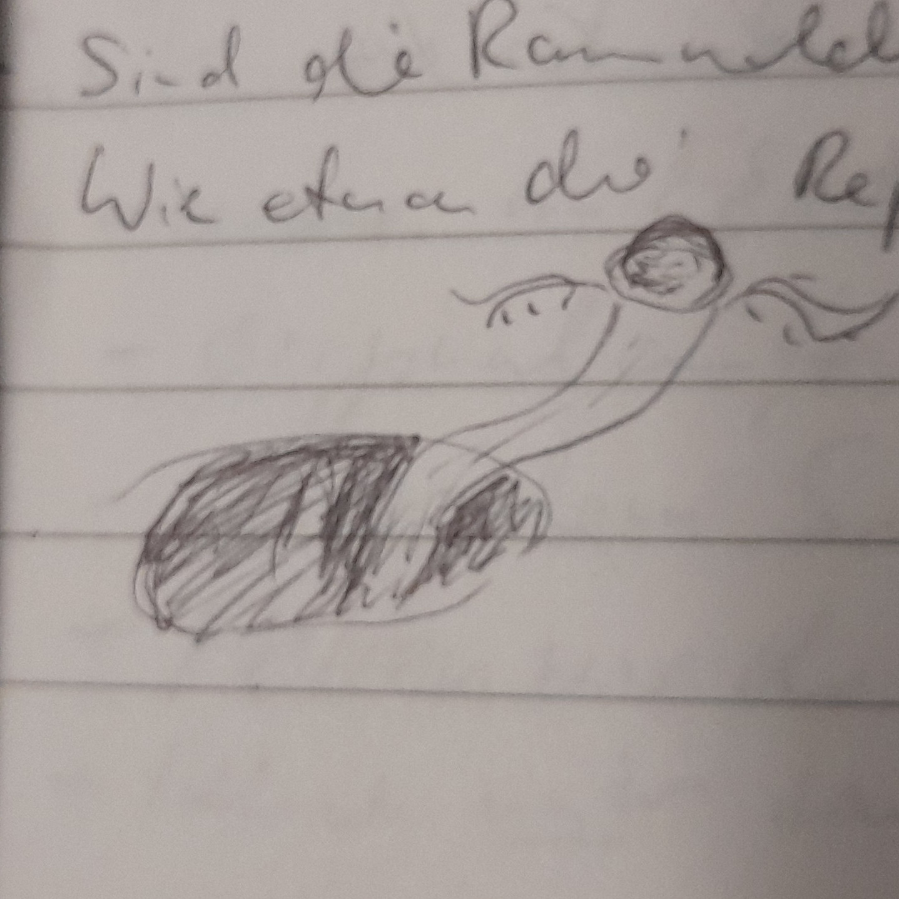
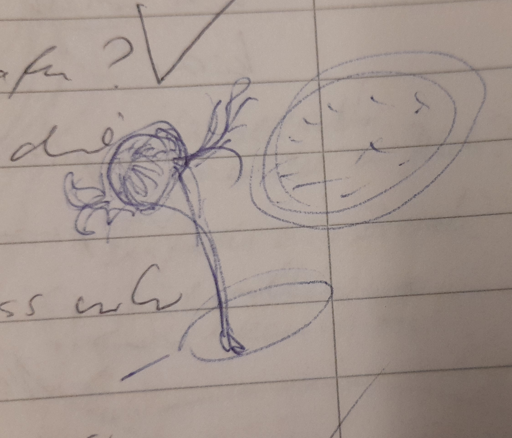

# Raummolche

"Inzwischen glauben wir zu wissen, dass die Raummolche über einen Riss im Raum-Zeit-Kontinuum in unsere Dimension geraten sind."

## Definition

Raummolche sind Wesen, die im All wohnen, unabhängig und frei. Sie lieben Brom.

Wo sich Brom befindet, trifft man zum Teil ganze Herden an. Nand, der eine bromgetränkte Scherbe Gottes in sich
trägt, wird oft von Raummolchen begleitet, wenn er sich im Raum bewegt.

... und sie sind Parasiten Gottes. Sie leben auf der Oberfläche und saugen dort das Brom aus. Dort befindet sich auch viele Brutstätten und Gelege.

Da man sich nicht mit ihnen verständigen kann, erscheinen sie als gedankenlose Wesen.

## Lebenszyklus

**Gelege** bezeichnet eine Traube an Eiern. Das Gelege ist hell und biofluoreszierend und wird als Brut nicht wahrgenomnen. Im Volksmund wird es schlicht bis bewundernd als Leuchtglobus bezeichnet.

**Nymphe** ist die kiemenlose Vorform, ein Sandwurm.

**Parasitierung** Die harmlosen Sandmolche können von Parasiten befallen werden, diese wachsen hinter dem Kopf an und sind buschig-fedrig. Die Parasiten übernehmen die Steuerung des Sandwurms, den man nun als Raummolch identifiziert.

**Adult** Parasit wie Molch sund i. d. R. auf der OG aufgewachsen und haben Gottesstaub in sicv eingebaut. Dirser begähigt sie zur Teleportation.

**Fortpflanzung**

## Vorkommen im Buch:

* 2031 im Fernsprech gehört
* Originalaufnahme, Erste Sichtung
* unter dem Baumschiff bei der Heirat
* Ferien mit der Familie an der Raumstation
* Ramolche umschwäremen Nand wg. des Splitters Gottes, Nand denkt, es wären seine Brometten, aber es sind mehr als "normal"

## Fragen

### Wie kamen die Raummolche ins Sonnensystem?'

Es gab zwei Ereignisse, welche das Dimensionsgefüge haben reissen lassen, wodurch sie ins SOnnensystem geschleidert
wurden:

* Versuch der Planetoformung der VenusXXXXX mithilfe von Unwahrscheinlichkeitstechnologie. Hierbei entstand ein kleiner
  Riss im Dimensionsgefüge. Durch diesen sind einige wenige Raummolche eingedrungen.
* Unwahrscheinlichkeits-BombeXXXXX

## Fortbewegung

Sie gleiten im elektro-magnetischen Raum entlang der Feldlinien und folgen einem beliebigen Strom.

## Raumkiemen - Parasiten

Die Raummolche selbst sind von einem weiteren Parasiten / Symbionten befallen, dieser bewirkt, dass seitlich des Kopfes Kiemen wachsen bzw. die Kiemen *sind* die Parasiten.
