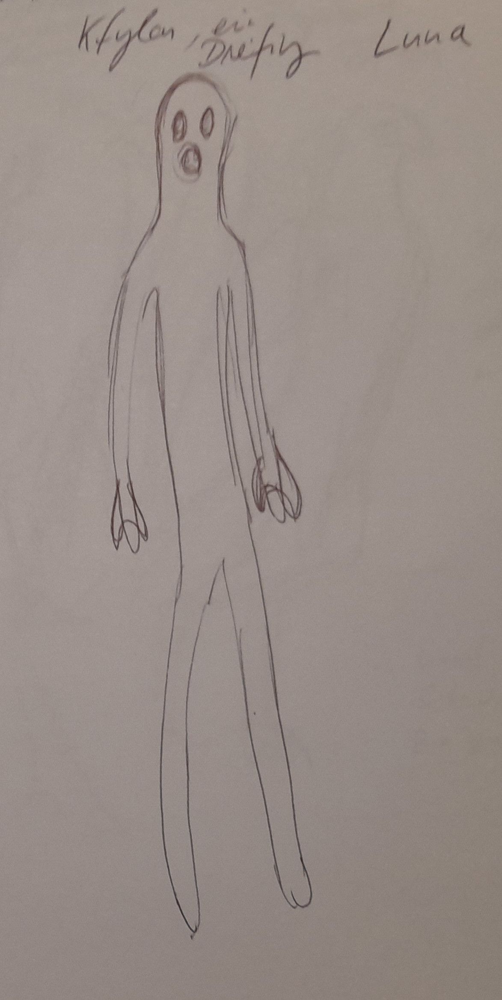

# Biologische Spezies

| Planet         | Volkname              | Aussehen           | Namen                                                   |
|----------------|-----------------------|--------------------|---------------------------------------------------------|
| Mars           | Sechsfinger??         | Feline             | english  Nand, Halo, Emy, Mary, Chryss, Sol, Honey |
| Terra          | Terraner, Langfinger  | Menschen und Hunde | lateinisch oder spanisch Gaius, Marcus, Titus      |
| Titan          | Flügelwesen           | Flügelwesen        | russisch, Zaphod, Igor, Ivanna, Larissa                 |
| Pluto          | Vielarme              | takusan-no-te      | Shokushu, Yamakawa, Myu                                 |
| Luna           | Dreifinger            | ---                | polnisch Kfyloon?                                       |
| Alpha Centauri | Barben                | ---                | Französisch, Julbert (Schülbär), Claudette              |

## Feline, Mars

Die Feline leben auf dem Mars. Vorab heissen sie Sechsfinger, aber das ändert sich wahrscheinlich.

Feline sind weitestgehend von katzenhafter Gestalt, laufen auf ihren zwei Hinterbeinen.

Die Spezies der Felinen ist eingewandert, aber es ist ein Mysterium woher. Es gibt die Legende vom Grossen Schyff, das sie hergebracht habe und auch wieder abholen werde.

Das Grosse Schyff hat auch die KI mit auf den Mars gebracht.

## Dreifinger, Luna

Die sogenannten Dreifinger stammen vom terranen Mond her. Sie sind schlank, haben einen kreisrunden Mund und erwartungsgemäss drei Finger.

Dreifinger sind von Natur aus freundlich und lieben philosophische Diskussionen. Ausserdem sind sie grundsätzlich zur Gegenwartsbrechung fähig ... zumindest, wenn sie Brom haben.

Die Dreifinger hatten versucht, sich bei der Venus neuen Wohnraum zu schaffen, worurch allerdings ein Riss im Dimensiosgefüge entstand. Daher hatten  sie bereits kKo takt zu Gott [in Arbeit]

Dreifinger rauchen entsprechend gern Bromette.

Entspricht Polen.

## Fünffinger, Terra

Zweibeinige Wesen, haben andere vierbeinige Terraner dabei ...

Entspricht Brittanien.

## Waberwesen, Pluto

Entspricht Japan.

## Titanen, Titan

Grosse, eindrucksvoll geflügelte Wesen. Man könnte sie für Engel halten, hätten sie nicht diesen grossen kräftigen Schnabel.

## Barben, Neith

Die Barben leben auf dem künstlich geschaffenen venaren Mond Neith. Sie sind grandiose Biohacker, die Pflanzen zu allem Möglichen umbauen.

Wo man auf dem Mars einen elektronischen Allempfänger erwarten würde, findet man bei drn Barben eine umstrukturierte Runkelrübe.

Entspricht Frankreich.

## Riesenbarben, Proxima Centauri

Die Riesenbarben sind grosse, plumpe Wesen, über deren Heimatplanet wenig bekannt. Sie sind Meister der Biotechnologie und passen jegliche Art von Flora an ihre Bedürfnisse an.

Sie sind die Vorfahrem der gentechnisch angepassten marsischen Barben und Zwergbarben.

Die Barben wurden durch den Neith-Zwischenfall auf dieses Sonnensystem aufmerksam. Mit einem Überlicht-Baumschiff überwanden sie die Strecke von Proxims Centauri zum Sonnensystem.

## Jupiteraner, Jupiter

Entspricht Maghreb.

## Zippelgussen

Kleine, huschige Wesen, vogelartig, ähnlich Teichhühnern.

## Kiementräger

Kiementräger entstehen, wenn die Mutter mit Raumkiemen-Parsiten infiziert ist. Sie sind keine eigene Spezies, sondern können einer beliebigen Spezies entstammen.

* Marser: Feline vertragen kein Brom; entweder sterben sie durch Bromvergifting oder die Parasiten sterben an Brommangel und nehmen den Wirt mit
* Dreifinger: bilden ihre Kiementräger philosophisch aus, sodas gehenwartsbrechen möglich wird

