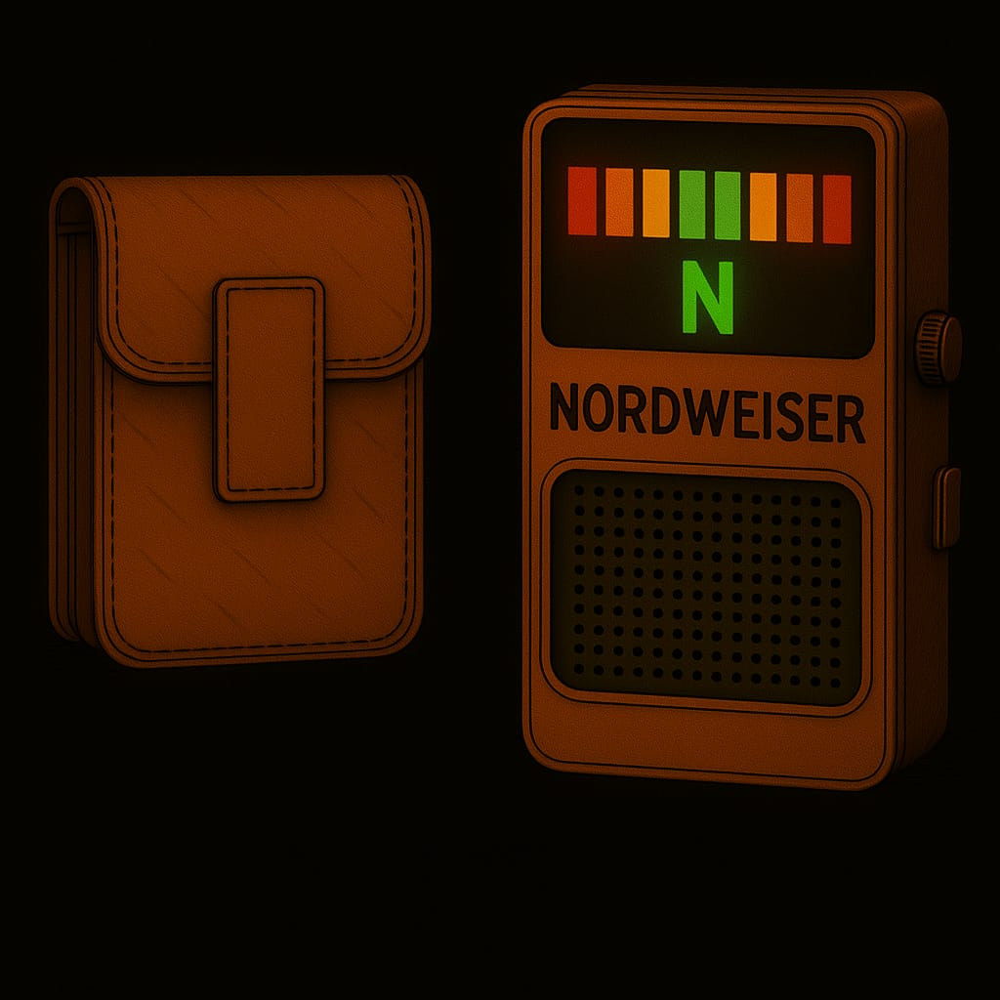
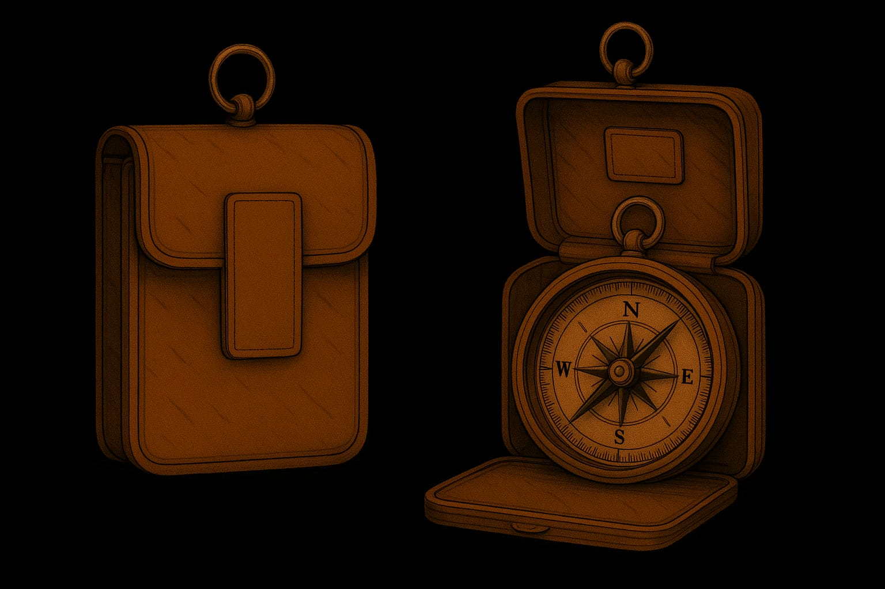
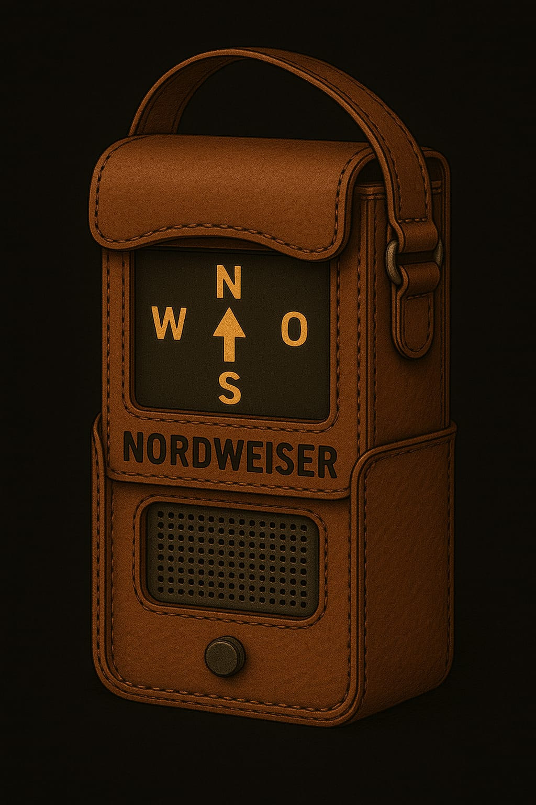
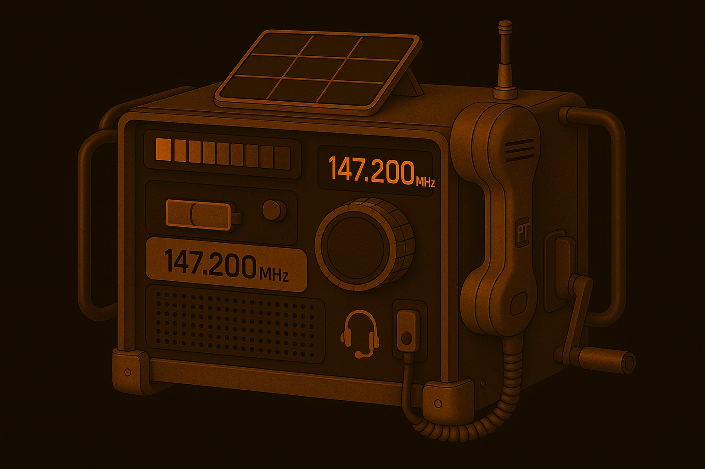
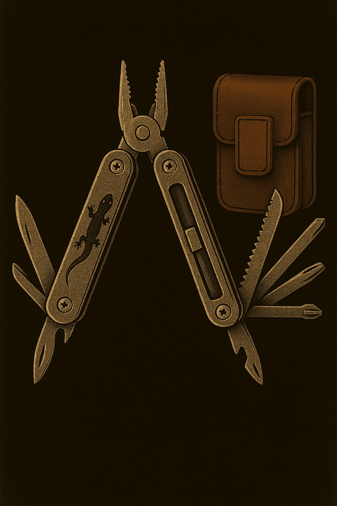

# MZ-Kadetten

Die Kadettschaft des Marsianischen Zephirs dient dazu, schon Kinder auf MZ-Treue zu schwören.
Man stelle sich einen PFadfinderverband vor, der bereits von Doktrinen evrseucht wird.

Schon Kinder lernen militärische Fähigkeiten wie Orientierungsläufe, Waffenkunde, Märsche, Funkprotokolle etc.

## 🎒 Geraffel

Geraffel oder Ausrüstung gibt es viel.

### 1. 🧭 Nordweiser

Ein Mars-kompass, der magnetisch zum Kuppelpol zeigt. Summt leicht, wenn man in die richtige Richtung schaut.

  

### 2. 🔪 Klappmesser Typ „Echsenschupp“

Multifunktionales Werkzeug mit Klinge, Schraubspitze, Drahtzange und Feuerstein im Griff. Für Lagerbau und Notfälle.

### 3. 📻 Funkkiste

Ein kurzwellen-Funkgerät, das zu zweit getragen werden muss. Reichweite ca. 2 meilen, braucht Tageslicht zum Aufladen.

### 4. 🔭 Mars-Feldstecher

Gekrümmte Linsen gegen Staubverzerrung. Hat Infrarot-Modus und Zielmarkierung (nur bei Kadetten 2. Stufe aktiviert).

### 5. 🛡️ Schutzkappe „Typ 3“

Hartfaser-Kopfschutz mit leichtem Kinnvisier. Schützt bei Stürzen und vor Sonnenstichen im Freien.

### 6. 🧤 Griffhandschuhe

Rutschfeste, atmungsaktive Handschuhe mit Verstärkung an den Fingerknöcheln. Gut zum Klettern oder Schleppen.

### 7. Kadettenkarte (ID-Chip)

Perso-ähnliche Karte mit Datenchip, der an Portstationen scannbar ist. Gibt Zugang zu Lagern und Proviantausgabe.

### 8. 🔋 Akku-Riegel Typ „Rundlicht“

Notstromversorgung für Kleingeräte. Hat eine kleine Lampe am Kopf, leuchtet bis zu 6 Stunden.

### 9. 🧵 Feldset „Flickfix“

Enthält Nadelfäden, Dungkleber, Gewebepflaster, Mini-Zange. Wird oft mit bunten Aufnähern personalisiert.

### 10. 📒 Übungsheft „Protokoll 12“

Robustes Schreibheft mit beschichtetem Umschlag. Dient zur Eintragung von Beobachtungen, Karten, Befehlskopien.

### 11. 🥄 Kombi-Besteck „Löffelwolf“

Mars-Klassiker: Löffel, Gabel und Mini-Säge in einem Stück Titan. Hat einen „Witzspruch des Tages“ eingraviert.

### 12. 🥼 Staubponcho Typ „Schleier 1“

Ein leichter, grauer Überwurf gegen Wind und Sand. Hat eingebaute Kapuze und reflektierende Fäden für Sichtbarkeit.

### 13. Feuerstahl, zur Generierung von Funken und letztendlich Feuer

## Medikit

