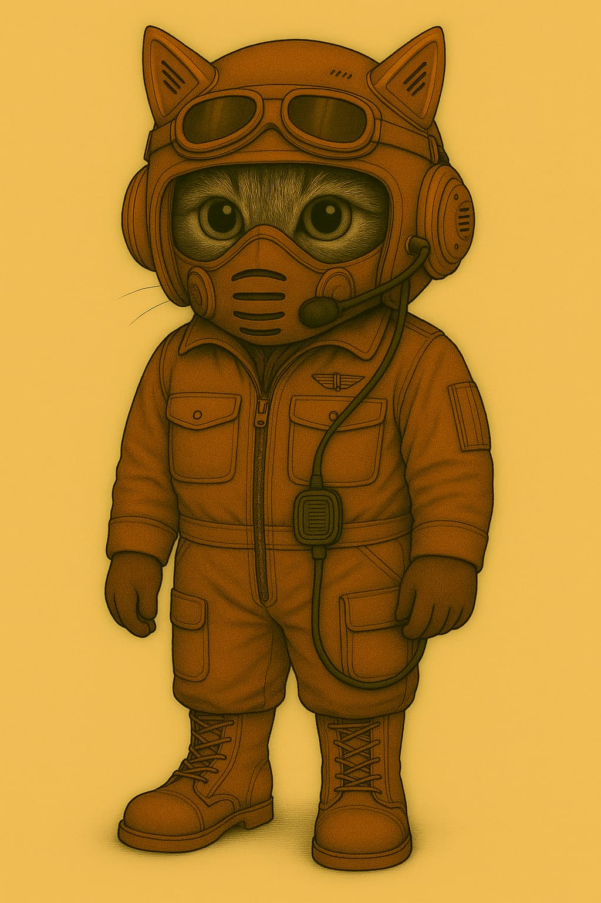

# MZ-Kadetten

Die Kadettschaft des Marsianischen Zephirs dient dazu, schon Kinder auf MZ-Treue zu schwören.
Man stelle sich einen PFadfinderverband vor, der bereits von Doktrinen evrseucht wird.

Schon Kinder lernen militärische Fähigkeiten wie Orientierungsläufe, Waffenkunde, Märsche, Funkprotokolle etc.

Hier siehst du einen dieser kleinen Kadetten :-)

## Pamphet

~~~txt
Wir, die Marser, werden gewinnen.
Und du hilft uns dabei.

Der Marsianische Zephir braucht DEINE Unterstützung.
Daher: DANKE, dass du hier im Wehrerziehungslager bist!
Und das macht Spass!

Lerne Granaten kennen und benutzen!
Schiesse mit der Mauser!
Erfahre alles über die Modularfaust! und:

Mache Deinen HR-Führerschein!!

Ja, richtig: du wirst selbst einen Hebroboto steuern.
Und zwar so einen, wie ihn die grossen Soldaten in der Schlacht tragen!

Melde dich zum Wehrerziehungslager!
Adrett, MZ!

PS: Wenn du ein Kind kennst, dass sich weigert, kannst du seine Familie hier auch gleich anzeigen.
~~~

