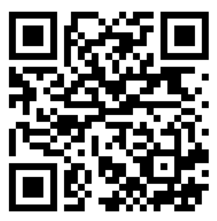
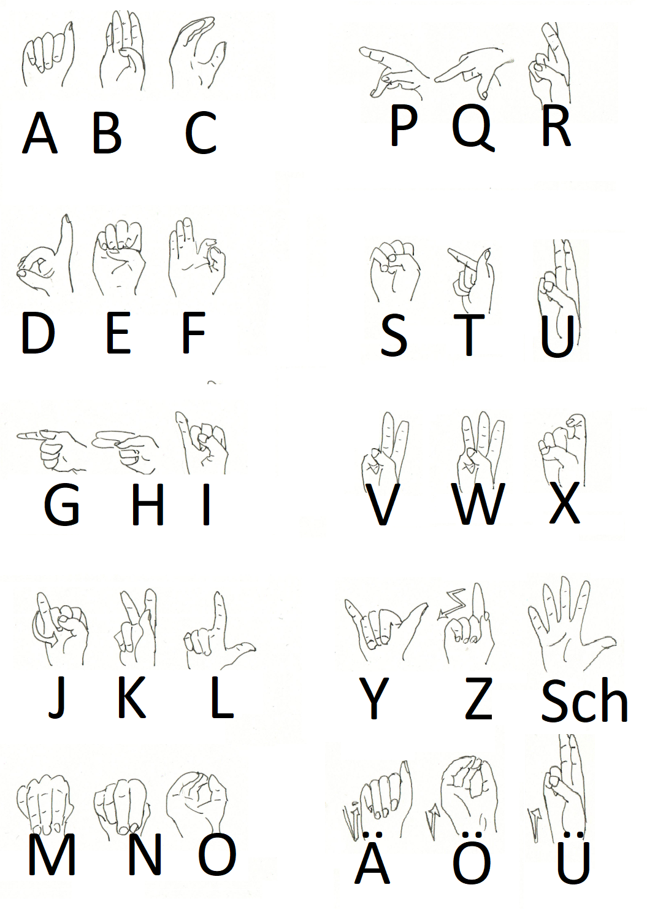

## Kommunikation

## 1. Gesprochene Sprache

Innerhalb von Gebäuden mit atembarer Atmosphäre braucht man keinen Helm oder Anzug.
Hier kann man ganz normal sprechen.

Ausser-Marser chaben gernä ainen AAkzent!

* Titanen: russischer Akzent, die Betonungen sind verschoben
* jedes "ch" => "kch"
    * a => aaa
    * ch => chch
    * h => ch
    * gezogene Vokale an den falschen Stellen
    * falsches grammatisches Geschlecht
    * Merkspruch: ich wiinscht ichch chätte ein Pferdeekutsch
* Lunare: französischer Akzent
    * jedes "ch" => "sch"
    * keine "h"
    * a => o
    * falsches grammatisches Geschlecht
    * Merkspruch: isch säe einö üben Kühlschronk

## 2. Funkprotokolle, gesprochen

### Einleitung

Kommunikation zwischen zwei und mehr Teilnehmern auf ein- und demselben Kanal setzt Disziplin voraus.
Damit das klappt, gibt es das Funkprotokoll.

Generell gilt:

* erste denken, dann sprechen
* wer das Gespräch startet, der endet es auch

Hier Beispiele:

### Beispiele

Einfach

* Gruppe I von Basis – Kommen
* hier gruppe 1 – kommen
* hier basis - befehl: Suchaktion einstellen – kommen
* hier gruppe 1 - verstanden kommen
* hier basis - ende

#### Eingespielter Funkverkehr

* Gruppe 1 von Basis, bla bla bla kommen
* hier gruppe x verstanden, ende

#### Achtung Spruch

* gruppe x von basis achtung spruch kommen
* hier gruppe x achtung sprung kommen
* hier basis ort datum uhrzeit frage / Nachricht wiederholen / kommen
* hier gruppe x ort datum, uhrzeit [wiederholung der nachricht] kommen
* hier basis verstanden

#### Reihenruf

* gruppe x,y,z von basis laber rhabarber kommen
* hier gruppe x verstanden kommen
* hier gruppe y verstanden kommen
* hier gruppe z verstanden kommen
* hier basis ende

#### Sammelruf

* alle von basis laber rhabarber kommen
* hier gruppe x verstanden kommen
* hier gruppe y verstanden kommen
* hier gruppe z verstanden kommen
* hier basis ende

## 3. Gebärdensprache

Mit Helm draussen und ohne Mikrophon oder sonstiogen Funkverkehr kann man draussen sich nicht unterhalten.
Der Helm hält den Schall so gut ab; allenfalls kann man sich schreiend unterhalten. Und das ist auf Dauer zu
anstrengend.

Draussen unterhalten sich alle in Gebärdensprache. Das heisst:

* Für jedes Wort bzw. für jeden Begriff gibt es ein Zeichen
* Das Verb ist immer hinten, also ICH PFERD SEHEN
* Mund und Mimik sind daran beteiligt

Umsetzung am Rollenspiel-Tisch

* Du kannst  DGS (Deutsche Gebärdensprache) => suuper! Verwende die!
* Du kannst keine DGS => unterhaltet euch einfach normal am Rollenspiel-Tisch; denkt aber daran: ihr könnt euch **nur
  auf Sichtweite** unterhalten; man kann niemandem hinterherrufen oder von hinten ansprechen :-D

Info: Grossschreibung? Ein Gebärdenbegriff wird durch Grossschreibung markiert.

| https://spreadthesign.com                                                        | https://signdict.org                                                   | https://manimundo.de                                                     |
|----------------------------------------------------------------------------------|------------------------------------------------------------------------|--------------------------------------------------------------------------|
|  |  |  |
| Lexikon                                                                          | Lexikon                                                                | Lernen                                                                |

#### Finger-Alphabet

Neue Begriffe werden mit dem Fingeralphabet aufgegriffen. Und das findest du hier:

