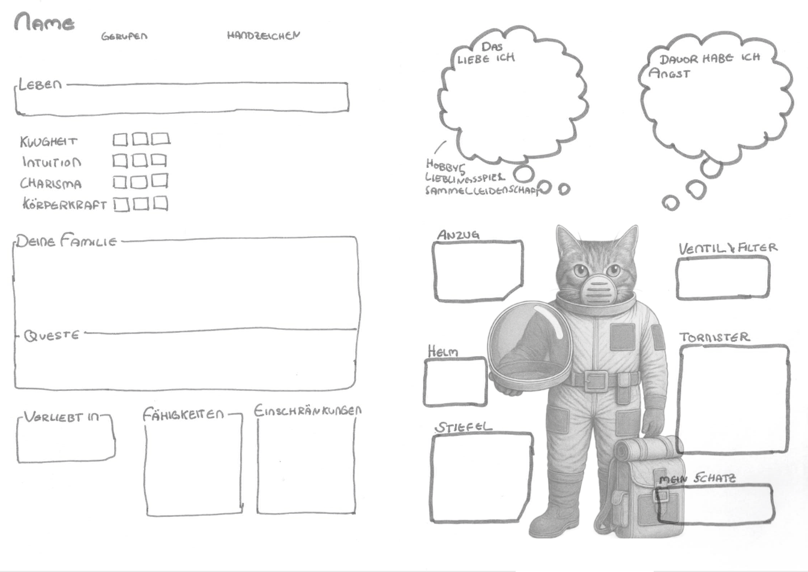
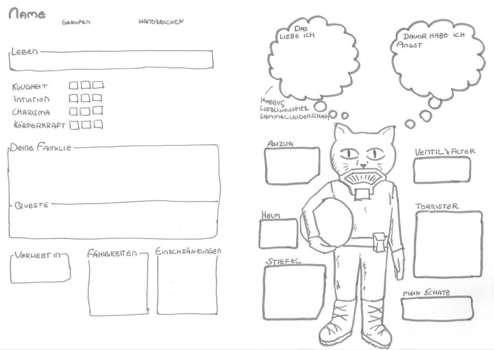

# Charaktererstellung

## Charakterbogen

| Download                                                               | Hinweis              | Preview                                                                                                            |
|------------------------------------------------------------------------|----------------------|--------------------------------------------------------------------------------------------------------------------|
| [Charakterbogen (PDF)](../_downloads/charakterbogen-ki-rot.pdf)        | farbig               |              |
| [Charakterbogen (PDF)](../_downloads/charakterbogen-ki-sw.pdf)         | schwarz-weiss        |                |
| [Charakterbogen (PDF)](../_downloads/charakterbogen-ki-hellgrau.pdf)   | hellgrau             |    |
| [Charakterbogen (PDF)](../_downloads/charakterbogen-ki-handgemalt.pdf) | handgemalt, original |  |
| [Charakterbogen (PDF)](../_downloads/charakterbogen-printed.pdf)       | handgemalt, original |                  |

## Grundwerte

* Name: ein- oder zweisilbig ist üblich
* Handzeichen für ausserhalb, weil man im Helm nicht reden kann
* Alter: 2W6 + 5
* Eigenschaften: KLugheit, INtuition, CHarisma, KKörperkraft, 10 Punkt insgesamt verteilen, Maximalwert 5
* Lebenspunkte: 2W6 + 5
* positive Eigenschaften / Fähigkeiten: im Wert von mindestens 5 auswählen
* negative Eigenschaften / Fähigkeiten: den gleichen Wert wie die positiven

## Rufname und Gebärdenname

Jeder hat einen Rufnamen und einen Gebärdennamen; auf diesen Seiten kannst du dir eine passende Gebärde aussuchen.

| [spreadthesign](https://spreadthesign.com)                                       | [signdict](https://signdict.org)                                       | [manimundo](https://manimundo.de)                                         |
|----------------------------------------------------------------------------------|------------------------------------------------------------------------|--------------------------------------------------------------------------|
|  |  |  |
| Lexikon                                                                          | Lexikon                                                                | Lernen                                                                   |

## Positive Eigenschaften

Wählen drei positive Eigenschaften aus in der Wertigkeit von mindestens 5.
Beispiel: Dein Charakter hat Fahrzeugsteuerung (3), Signalgeber (2) und Lautlos bewegen (2) => also insgesamt gute Eigenschaften mit einer Wertigkeit von 3+2+2 = 7

### ⚙️ Technik & Maschinen

* Fahrzeugsteuerung – 3
* Maschinenwartung – 2
* Improvisationstechnik – 1
* Sensoren & Scanner nutzen – 2

### 🔥 Überleben & Umwelt

* Navigation im Ödland – 3
* Hitzeresistenz – 2
* Vorratsschätzung – 1
* Staubsturm-Taktik – 1

### 🧠 Wissen & Analyse

* Planetoforming-Wissen – 2
* Mars-Geologie – 2
* Feindliche Taktiken – 2
* Codes und Systeme – 1

### 🗣️ Team & Kommunikation

* Taktisches Denken – 3
* Kaltblütig unter Druck – 2
* Signalgeber – 2
* Mentale Stärke – 1

### 🤺 Kampf & Bewegung

* Nahkampf – 3
* Waffenkenntnis – 2
* Lautlos bewegen – 2
* Schnelle Reaktion – 1

### 🛠️ Spezialfähigkeiten

* Nachtblick – 3
* Maschinensprache – 2
* Feuerhand – 1
* Staubschatten – 1

### 🎨 Musische Künste

* Dichten – 2
* Rhythmus und Helm-Kunst – 1
* Lieder erfunden und singen – 2
* Malen – 1

## Negative Eigenschaften – ggf. würfeln

Suche dir mindestens 3 Behinderungen in derselben Wertigkeit aus, wie Du gute Eigenschaften hast.

**Beispiel**: Dein Charakter hat Fahrzeugsteuerung (3), Signalgeber (2) und Lautlos bewegen (2) => also insgesamt gute
Eigenschaften mit einer Wertigkeit von 3+2+2 = 7

Also wählst du Schwache Nachtsicht (1), Blind auf einem Auge und Lichtempfindlichkeit (3) und Künstliches Bein (3), also 1+3+3 = 7

Statt zu wählen kannst du auch einfach mit 2 W6 würfeln. Ggf. musst du ein bisschen anpassen, weil ich manche guten Eigenschaften und Behinderungen einander ausschliessn, z. B.Lautlos bewegen und Lärmverursacher.

### ⚠️ Kleine Behinderungen (1 Punkt)

(Leicht störend, situationsabhängig)

* 2 - Schwache Nachtsicht – sieht in Dunkelheit deutlich schlechter als andere
* 3 - Ungeschickte Hände – oft Probleme mit Feinmotorik oder Technik
* 4 - Ungeduldig – verliert schnell die Nerven bei Wartezeiten oder Routine
* 5 - Lärmverursacher – bewegt sich laut, tritt auf Metall, klappert ständig
* 6 - Orientierungslos – kann sich in unbekanntem Gelände schlecht merken, wo er/sie ist
* 6-6 - Kleiner als andere – wird oft übersehen oder unterschätzt
* 7 - Sozial unbeholfen – redet sich schnell um Kopf und Kragen, wirkt oft merkwürdig
* 8 - Stauballergie – ständiges Husten, Niesen, gereizte Augen (ungünstig auf dem Mars...)
* 9 - Chronischer Husten – vor allem bei Staub oder Anstrengung
* 10 - Lichtempfindlich – grelles Licht verursacht Schmerzen oder Tränen
* 11 - Leichter Sprachfehler – stottert leicht oder spricht sehr langsam
* 12 - Schwache Orientierung – verläuft sich leicht in unbekannten Umgebungen

### ⚠️⚠️ Mittlere Behinderungen (2 Punkte)

(Haben klar spürbare Auswirkungen, aber noch mit Mühe ausgleichbar)

* 2 - Schwache Lunge – bei körperlicher Belastung schnell ausser Atem
* 3 - Technikfeindlich – versteht Maschinen schlecht, oft Fehlbedienungen
* 4 - Traumatisiert – wird bei bestimmten Reizen (z. B. Explosionen, Dunkelheit) handlungsunfähig
* 5 - Schwerfällig – langsam in Bewegungen, schwer auszuweichen oder zu fliehen
* 6 - Paranoia – misstraut Teammitgliedern, sieht überall Verrat
* 6-6 - Einäugig – eingeschränktes Sichtfeld und räumliches Sehen
* 7 - Ungeübter Kämpfer – verliert in fast jedem Nahkampf
* 8 - Anfallsleiden (z. B. Epilepsie) – in Stress oder unter Flackern besteht Gefahr eines Anfalls
* 9 - Koordinationsstörung – Bewegungen sind oft ungeschickt oder verzögert, Stolpern oder Missgeschicke häufig
* 10 - Schwache Muskeln – kann keine schweren Lasten tragen oder lange laufen
* 11 - Tremor (Zittern) – Hände zittern bei Aufregung oder Kälte, schwer bei Präzisionsarbeiten
* 12 - Starke Angst vor Dunkelheit – in dunklen Gängen oder Nächten schnell panisch
*

### ⚠️⚠️⚠️ Grosse Behinderungen (3 Punkte)

(Massiv einschränkend, dominanter Teil der Figur)

* 2 - Künstliches Bein – eingeschränkte Beweglichkeit, besonders bei Klettern oder Sprint
* 3 - Chronische Schmerzen – erträgt Belastung nur mit Willenskraft oder Medikamenten
* 4 - Starke Klaustrophobie – Panik in engen Räumen, Fahrzeugkabinen, Schächten
* 5 - Unkontrollierbare Wutanfälle – kann in Stresssituationen Team gefährden
* 6 - Maschinenhass – verweigert Zusammenarbeit mit KI, Robotern oder selbstfahrenden Geräten
* 6-6 - Psychische Instabilität – Stimmen, Wahnvorstellungen, Realität verschwimmt zeitweis
* 7 - Starke geistige Entwicklungsverzögerung – versteht vieles langsamer, braucht Geduld und Schutz
* 8 - Nicht sprechfähig – kann gar nicht sprechen, nutzt Zeichen, Tafeln oder Blicksteuerung
* 9 - Lähmung ab der Hüfte – spürt Beine nicht, braucht Hilfsmittel, anfällig für Druckstellen oder Verletzungen
* 10 - Angewiesen auf Beatmungsgerät – muss regelmässig an eine Maschine, trägt ggf. ein mobiles Systeme
* 11 - Massive Trauma-Folgen (PTBS) – bei bestimmten Reizen (z. B. Sirenen, Uniformen, engen Räumen) völliger Kontrollverlust, Panik oder Erstarren
* 12 - Blind auf einem Auge + starke Lichtempfindlichkeit – oft gezwungen, sich zurückzuziehen

## Stufenanstieg

Nach jedem Abenteuer darfst du:

* einen zusätzlichen Punkt auf deine Eigenschaften vergeben; also z. B: KLugheit oder INtuition steigern
* zusätzliche positive Eigenschaft

Info: eine zusätzlich Behinderung musst du dir nicht auswählen. Das anfängliche Set-up ust genug. Natürlich kannst du dich **freiwillig** für ein weiteres Manko entscheiden. Tipp: bbringe dies in Bezug zum Abenteuer, also z. B. eine klaustrophobische Störung, weil du im letzten Abenteuer in einer klaustrophoibischen Situation warst.

## Geheimnisse & Questen

| Geheimnis                                                                                                                                                                                                                     | Queste                                                                                                                                                                     |
|-------------------------------------------------------------------------------------------------------------------------------------------------------------------------------------------------------------------------------|----------------------------------------------------------------------------------------------------------------------------------------------------------------------------|
| Deine Familie ist einfach total arm. Dein Anzug ist alt und überall geflickt.                                                                                                                                                 | Kleptomanisch, du musst einfach
 alles stehlen. Nimm alles mit, was nicht niet- und nagelfest ist.                                                                                                                                                             |
| Deine Familie versteckt eine schwache KI in ihrem Keller. Sie möchte fliehen, ist aber zu schwach. Wenn das rauskommt, werdet ihr alle deportiert.                                                                            | Finde einen passenden Akkumulator für die KI. Sie gehört zur Baureihe K69-4, daher sollten alle K-Akkumulatoren passen.                                                    |
| Dein Geschwister ist schwerhörig. Draussen fällt das nicht auf, weil ihr Handzeichen macht. Daher gibst Du ihr immer heimlich Zeichen, um zu übersetzen. Du hat beständig Angst, dass ihr entlarvt werdet.                    | Du magst Gladiatorenkarten. Gladiatoren sind mächtig und haben nie Angst. Besorge Gladiatorenkarten oder laufe sogar selbst mal in einem HR rum.                           |
| Du bist schwerhörig. Wenn das rauskommt, wirst du deportiert. Du bleibst immer bei deinem Geschwister, der/die dir mit Handzeichen übersetzt.                                                                                 | Du hast gehört, dass es bessere Helm gibt, mit Lautsprechern. Das wäre zumindest für draussen super. Es soll ganz viele von diesen Helmen in der Graffelei geben.          |
| Deine kleine Schwester ist seit letztem Jahr behindert, weil sie Bromismus hatte. Es hingt irgendwie mit ihren Kiemen zusammen. Es ist ganz schlimm. Du willst gar nicht mehr nachhause, denn sie hat die ganze Zeit Spasmen. | Finde ein Biologiebuch oder irgend etwas, wo Bromismus erklärt wird. Vielleicht kann dir einfach auch einer der Erwachsenen Auskunft geben. Deine Schwester braucht Hilfe. |
| Du hältst dich für dumm. Sehr dumm. In Planetenkunde hast du eine 6 geschrieben. Deshalb bleibst du sitzen. Wie peinlich!                                                                                                     | Stiel                                                                                                                                                                      |
| Du hast ein kleines Tierbaby (einen "Flimmerschwanz") gefunden und versteckt es in einem leeren Rohr im Heizsystem.                                                                                                           | Besorge heimlich Futter – und ein weiches Tuch finden, bevor das Tier krank wird oder jemand das Piepen hört.                                                              |
| Du kannst mit einer alten KI über ein kaputtes Funkarmband sprechen – aber nur nachts, wenn die anderen schlafen.                                                                                                             | Du willst herausfinden, wer die KI früher war – und ihr helfen, ihren "verlorenen Namen" im alten Verwaltungsarchiv zu finden.                                             |
| Du hast Angst vor dem Marsstaub – er bekommt davon manchmal keine Luft. Aber niemand darf es wissen, weil du sonst "ungeeignet" bist.                                                                                         | Du willst dir selbst helfen, indem du  einen stillgelegten Filterrucksack aus dem Lager reparierst – ohne erwischt zu werden.                                              |
| Du hast eine alte Spieluhr ihrer Mutter gefunden – sie spielt eine Melodie, die in der Propaganda verboten ist.                                                                                                               | Du willst herausfinden, warum das Lied verboten wurde – und wer der Mann "Reude" ist, dessen Name auf der Unterseite eingeritzt ist.                                       |

