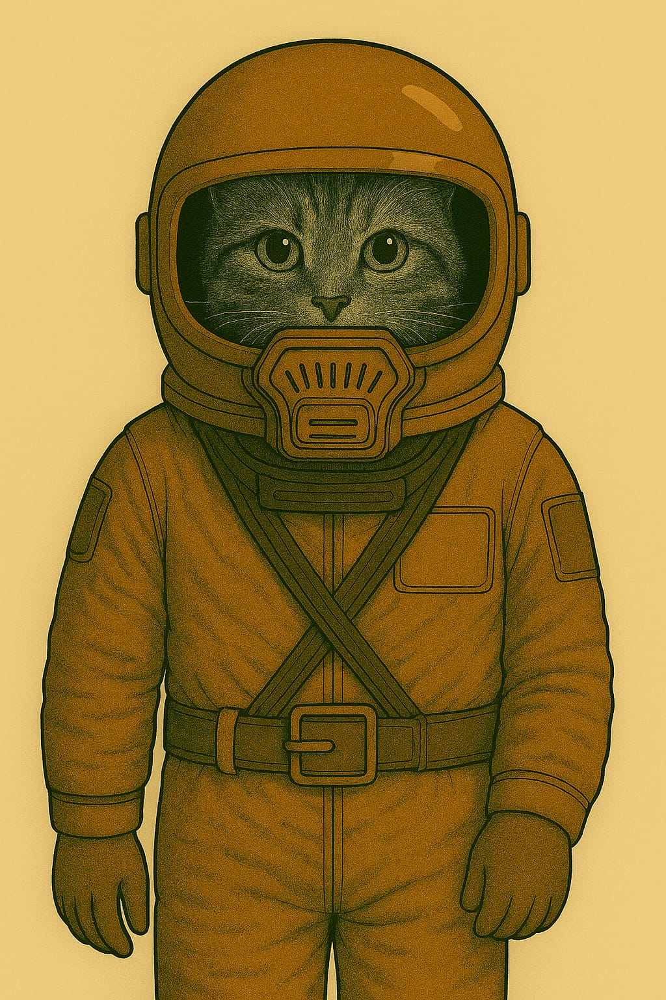
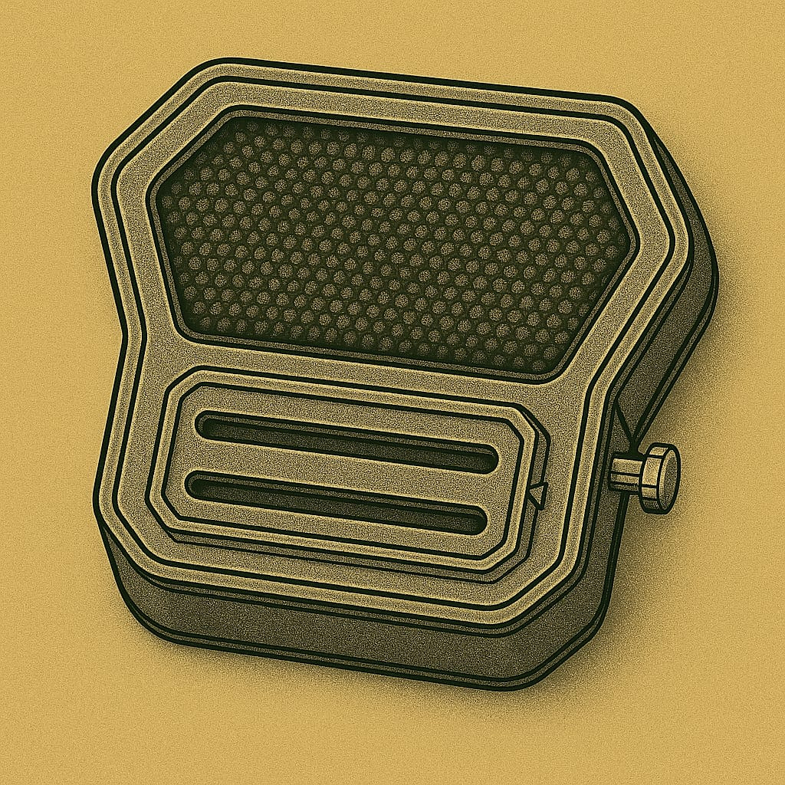
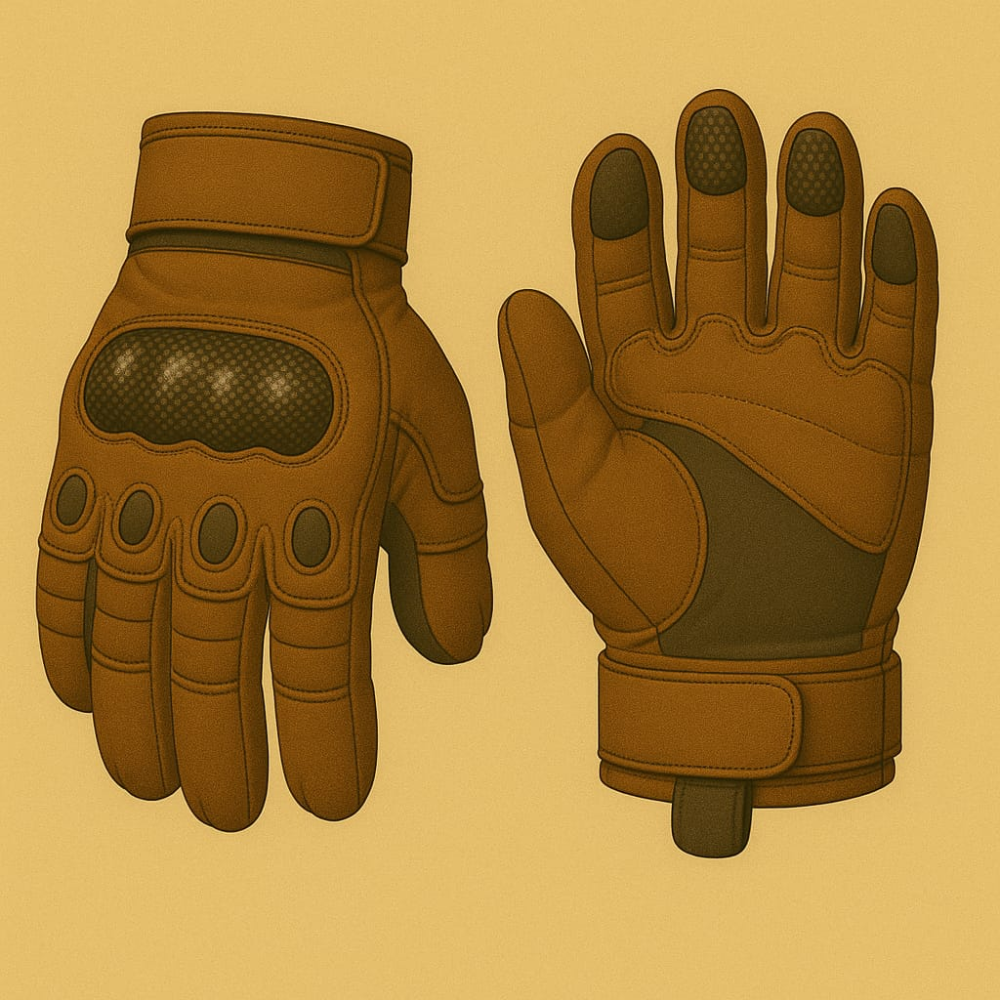

# Anzüge

## Leichtatmer

Für kurze Ausseneinsätze

### Leichtatmer

### Leichtatmer mit Helm

## Kadetten-Anzug

### Kadett Standard

## Soldaten-Anzüge

### Anzug mit Kommunikation-Einheit

### Panzerhelm eines Soldaten - Typ 1

### 🛡 Panzerhelm eines Soldaten - Typ 3

Vollschutzhelm aus hochstabilem Verbundmaterial mit integriertem Panorama-Visier. Bietet maximalen Schutz bei Stürzen, Staubeinwirkung und extremer Sonneneinstrahlung. Kompatibel mit dem externen Anzugs-Filtersystem „Typ 5“. Ideal für Ausseneinsätze unter harschen Umweltbedingungen.

### 🛡 Schutzkappe des Lazerett-Piloten (LP)

Hartfaser-Kopfschutz mit leichtem Kinnvisier. Schützt bei Stürzen und vor Sonnenstichen im Freien.

* Verwendung: Innenbereiche · Werkdienst · Appelle · Kurzzeitiger Außeneinsatz

Diese Schutzkappe ist ein leichter Hartfaserhelm für den täglichen Gebrauch in Habitaten, technischen Bereichen und bei kurzen Wegen im Freien. Sie vereint grundlegenden Kopfschutz mit Tragekomfort und ist für den Einsatz mit dem Leichtatmer (L-F1) konzipiert.

**🔩 Designmerkmale**

* Form: Kompakte Halbschale mit tiefgezogenem Nacken- und Schläfenschutz.
* Visier: Fest montierte, integrierte Schutzbrille mit großem Sichtfeld – geeignet für den Einsatz bei hoher Helligkeit und leichtem Staubeintrag.
* Kinnbereich: Flaches, stabiles Kinnvisier mit direkter Leichtatmer-Anbindung (Riemenführung außenliegend).
* Farbe: Kolonie-standardisierte Uniformfarbe (rostrot / terrakotta).
* Innenpolsterung: Leichte, stoßabsorbierende Auskleidung – angenehm zu tragen, auch über längere Zeiträume.

**🛠️ Technische Daten**

* Material: Gepresste Hartfaser mit mineralischer Außenbeschichtung
* Gewicht: ca. 900 g
* Schutzwirkung:
    * Reduziert Verletzungsrisiken bei Sturz aus Standhöhe
    * Schirmt direkte Sonnenstrahlung ab (UV-reduzierend)
    * Kein Schutz bei Hochgeschwindigkeits- oder Vakuumbelastung
* Kompatibilität: Leichtatmer (L-F1-Serie)

**⛑️ Einsatzprofil**

Die Schutzkappe „Typ 3“ wird regelmässig getragen bei:

* Kontrollgängen und Arbeitsschichten im Innenbereich * Appellen, Befehlsausgaben und Sicherheitsinspektionen
* Kurzen Gängen zwischen Habitatmodulen oder auf abgeschirmten Außenplattformen

Hinweis:
Nicht für Ausseneinsätze mit starker Windbelastung oder Temperaturschwankungen vorgesehen. Kein Ersatz für vollisolierte Raumhelme.

### Anzug mit Kommunikations-Einheit

Kopfhörer aussen am Helm und ein Mikrofon das magnetisch von aussen am Filter befestigt wird.

## Rüstungen

### Vollrüstung Militär

## Helme

## Handschuhe

## Arbeitsanzug

[in Arbeit]
