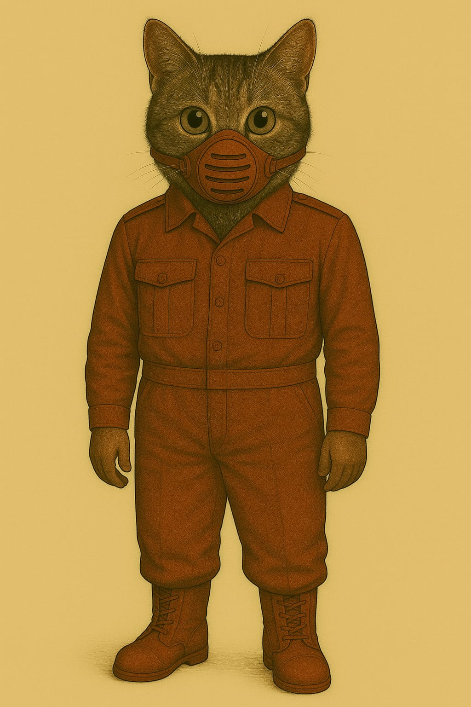
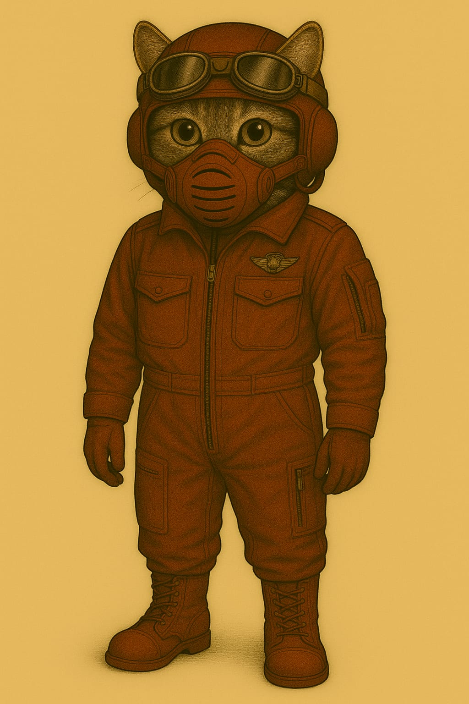
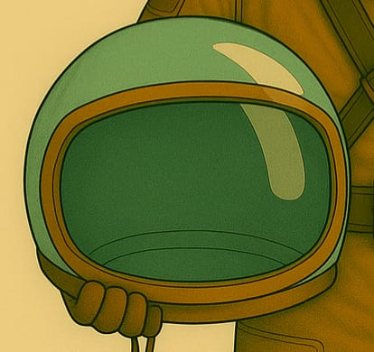
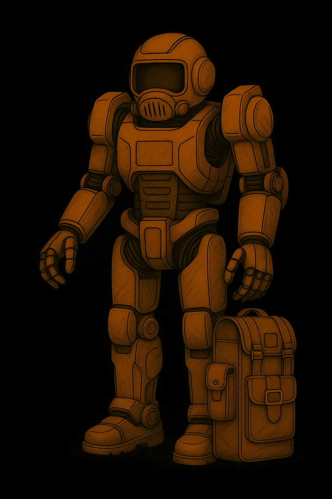

# Anzüge

## Leichtatmer

Für kurze Ausseneinsätze

**Leichtatmer**

**Leichtatmer mit Helm**

## Kadetten-Anzug

**Kadett Standard**

## Soldaten-Anzüge

**Anzug mit Kommunikation-Einheit**

**Panzerhelm eines Soldaten - Typ 1**

**Panzerhelm eines Soldaten - Typ 3**

**Lazerett-Pilot (LP)**

## Rüstungen

**Vollrüstung Militär**

## Helme

## Handschuhe

## Arbeitsanzug

[in Arbeit]
