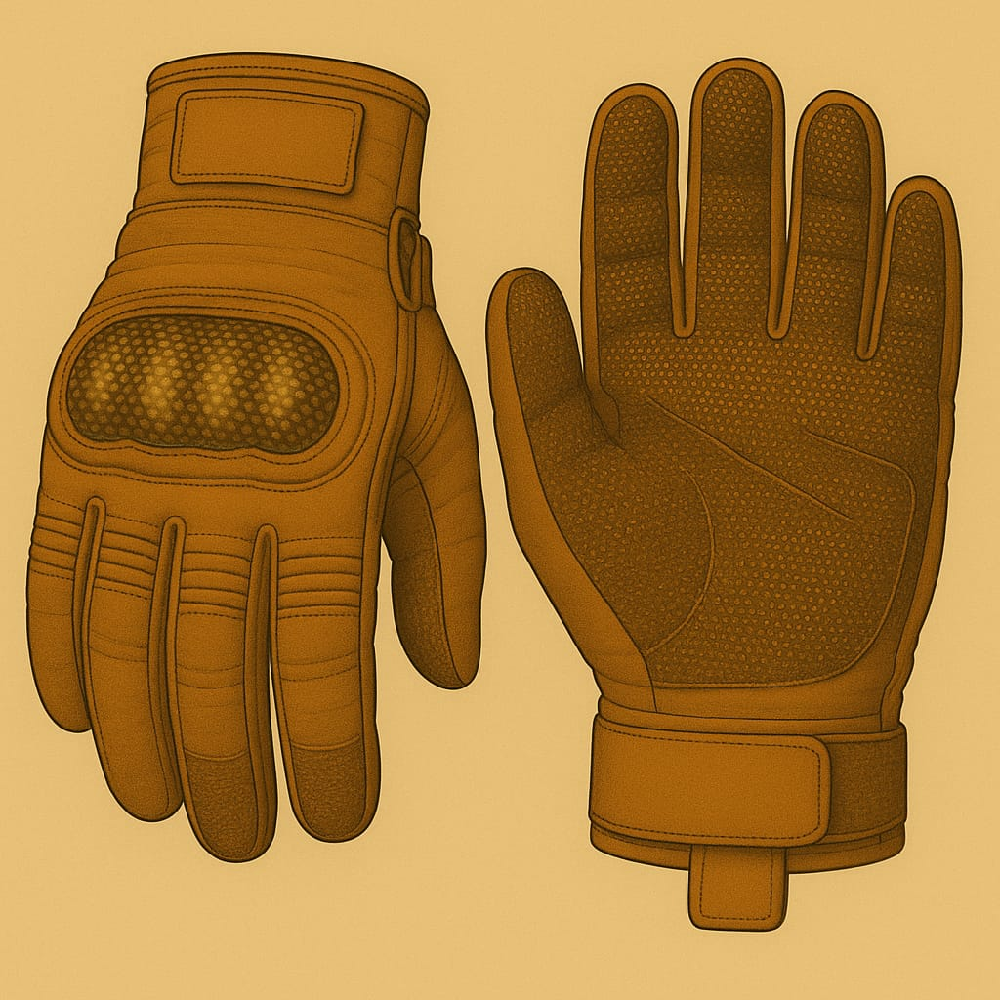

# Anzüge

## Leichtatmer

Für kurze Ausseneinsätze

**Leichtatmer**

**Leichtatmer mit Helm**

## Kadetten-Anzug

**Kadett Standard**

## Soldaten-Anzüge

**Anzug mit Kommunikation-Einheit**

**Panzerhelm eines Soldaten - Typ 1**

**🛡 Panzerhelm eines Soldaten - Typ 3**

Vollschutzhelm aus hochstabilem Verbundmaterial mit integriertem Panorama-Visier. Bietet maximalen Schutz bei Stürzen, Staubeinwirkung und extremer Sonneneinstrahlung. Kompatibel mit dem externen Anzugs-Filtersystem „Typ 5“. Ideal für Ausseneinsätze unter harschen Umweltbedingungen.

**🛡 Schutzkappe des Lazerett-Piloten (LP)**

Hartfaser-Kopfschutz mit leichtem Kinnvisier. Schützt bei Stürzen und vor Sonnenstichen im Freien.

****

Kopfhörer aussen am Helm und ein Mikrofon das magnetisch von aussen am Filter befestigt wird.

## Rüstungen

**Vollrüstung Militär**

## Helme

## Handschuhe

## Arbeitsanzug

[in Arbeit]
