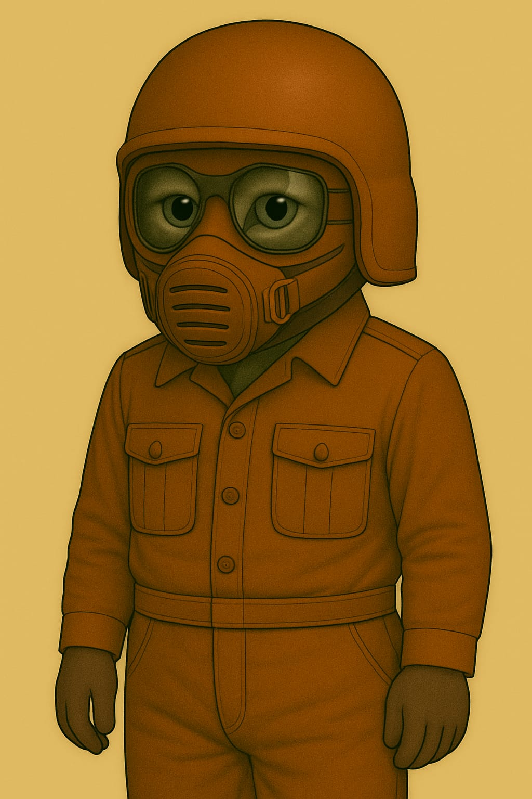

# Anzüge

## Leichtatmer

Für kurze Ausseneinsätze

### Leichtatmer

### Leichtatmer mit Helm

## Kadetten-Anzug

### Kadett Standard

## Soldaten-Anzüge

### Anzug mit Kommunikation-Einheit

### Panzerhelm eines Soldaten - Typ 1

## Standard-Feldanzug (Innen- & Unteranzug)

Verwendung: Habitatbetrieb · Appelle · Technikbereiche · Unteranzug für Außeneinsätze

### 🧰 Funktionaler Überblick

Der Standard-Feldanzug ist ein einheitlich gefertigtes Bekleidungsstück für den täglichen Einsatz auf dem Mars. Er dient primär als Innenraum-Uniform für alle Aufgaben innerhalb von Habitaten und Stationen – inklusive Verwaltung, Technik, Medizin, Versorgung oder Sicherheit. Gleichzeitig ist er als Unteranzug für längere Außeneinsätze vorgesehen: Er wird direkt unter einem externen Schutzanzug (z. B. Raumanzug, Exo-Einsatzsystem) getragen und bietet dafür ideale Kompatibilität.

### 🧥 Oberteil – Uniformjacke

* Farbe: Dunkel-terrakottafarbener Ton – erkennbar, traditionsbewusst, schmutzunempfindlich.
* Material: Hochreißfestes, atmungsaktives Mischgewebe mit Staubschutzbeschichtung und guter Thermoisolierung.
* Ausstattung:
    * Front: durchgehende Knopfleiste mit flachen Druckknöpfen (auch unter Exoanzügen nicht störend).
    * Kragen: klassisch, flachliegend – vorbereitet für Kragenfilter, Innenhelmeinlass oder Kommunikationsaufsatz.
    * Taschen: Zwei Brusttaschen mit Patten – flach gehalten, um unter Anzügen nicht aufzutragen.
    * Schultern: mit interner Verstärkung zur Druckverteilung bei Tragesystemen oder Rucksackmodulen.

### 👖 Unterteil – Hose

* Schnitt: Körpernah, aber bewegungsfreundlich. Beine verjüngt, Abschluss für Stiefeloptimierung.
* Details:
    * Seitliche Eingrifftaschen.
    * Verstärkte Knie- und Gesäßbereiche (besonders nützlich beim Kriechen oder langen Tragen).
    * Gürtelbereich: kompatibel mit Innenriemen oder Versorgungsverkabelung.
* Anwendung: Die Hose kann dauerhaft getragen und einfach in einen Außenschutz integriert werden (kein Umziehen notwendig).

### 🥾 Stiefel

* Modell: Mars-Innenstiefel, robust und komfortabel.
* Funktion: Ausgelegt für Alltag und kurzzeitigen Außeneinsatz.
* Merkmale:
    * Weicher Schaftabschluss zum Andocken von Außengamaschen oder Anzugabdichtungen.
    * Rutschhemmend, hitzebeständig.
    * Schnellschnürung für schnelles An- und Ausziehen in Luftschleusen.

### 😷 Leichtatmer (L-F1-Serie)

* Typ: Halbmaske mit Basisstaubfilter.
* Funktion: Schutz bei reduzierter Filterleistung im Inneren, leichten Leckagen oder auf kurzen Außenwegen.
* Design: Elastische Bänder, flaches Filterprofil, kompatibel mit der leichten Schutzkappe oder dem Pilotenhelm-System.
* Besonderheit: Kann im Außenbereich weitergetragen werden, wenn der externe Helm abgenommen wird (z. B. zur Wartung oder Erholung).

### 🔧 Modularität & Schichtung

* Innentragung: Unter Exo-, Raum- oder Versorgungsanzügen.
* Schichtkonzept:
    1. Unterwäsche (technisch oder leicht isolierend)
    2. Feldanzug (dieses Modell)
    3. Außensystem (Anzug, Versorgung, Schutz)
* Der Feldanzug ist so gefertigt, dass er weder scheuert noch staut, auch bei stundenlangem Tragen unter Druckanzügen. Schweiß wird nach außen geleitet, Druckstellen werden durch den Schnitt vermieden. Die Oberfläche reduziert Reibung zu Außenanzügen.

### 🛡 Panzerhelm eines Soldaten - Typ 3

Vollschutzhelm aus hochstabilem Verbundmaterial mit integriertem Panorama-Visier. Bietet maximalen Schutz bei Stürzen, Staubeinwirkung und extremer Sonneneinstrahlung. Kompatibel mit dem externen Anzugs-Filtersystem „Typ 5“. Ideal für Ausseneinsätze unter harschen Umweltbedingungen.

### 🛡 Schutzkappe des Lazerett-Piloten (LP)

Hartfaser-Kopfschutz mit leichtem Kinnvisier. Schützt bei Stürzen und vor Sonnenstichen im Freien.

* Verwendung: Innenbereiche · Werkdienst · Appelle · Kurzzeitiger Außeneinsatz

Diese Schutzkappe ist ein leichter Hartfaserhelm für den täglichen Gebrauch in Habitaten, technischen Bereichen und bei kurzen Wegen im Freien. Sie vereint grundlegenden Kopfschutz mit Tragekomfort und ist für den Einsatz mit dem Leichtatmer (L-F1) konzipiert.

**🔩 Designmerkmale**

* Form: Kompakte Halbschale mit tiefgezogenem Nacken- und Schläfenschutz.
* Visier: Fest montierte, integrierte Schutzbrille mit großem Sichtfeld – geeignet für den Einsatz bei hoher Helligkeit und leichtem Staubeintrag.
* Kinnbereich: Flaches, stabiles Kinnvisier mit direkter Leichtatmer-Anbindung (Riemenführung außenliegend).
* Farbe: Kolonie-standardisierte Uniformfarbe (rostrot / terrakotta).
* Innenpolsterung: Leichte, stoßabsorbierende Auskleidung – angenehm zu tragen, auch über längere Zeiträume.

**🛠️ Technische Daten**

* Material: Gepresste Hartfaser mit mineralischer Außenbeschichtung
* Gewicht: ca. 900 g
* Schutzwirkung:
    * Reduziert Verletzungsrisiken bei Sturz aus Standhöhe
    * Schirmt direkte Sonnenstrahlung ab (UV-reduzierend)
    * Kein Schutz bei Hochgeschwindigkeits- oder Vakuumbelastung
* Kompatibilität: Leichtatmer (L-F1-Serie)

**⛑️ Einsatzprofil**

Die Schutzkappe „Typ 3“ wird regelmässig getragen bei:

* Kontrollgängen und Arbeitsschichten im Innenbereich * Appellen, Befehlsausgaben und Sicherheitsinspektionen
* Kurzen Gängen zwischen Habitatmodulen oder auf abgeschirmten Außenplattformen

Hinweis:
Nicht für Ausseneinsätze mit starker Windbelastung oder Temperaturschwankungen vorgesehen. Kein Ersatz für vollisolierte Raumhelme.

### Anzug mit Kommunikations-Einheit

Kopfhörer aussen am Helm und ein Mikrofon das magnetisch von aussen am Filter befestigt wird.

## Rüstungen

### Vollrüstung Militär

## Helme

## Handschuhe

## Arbeitsanzug

[in Arbeit]
