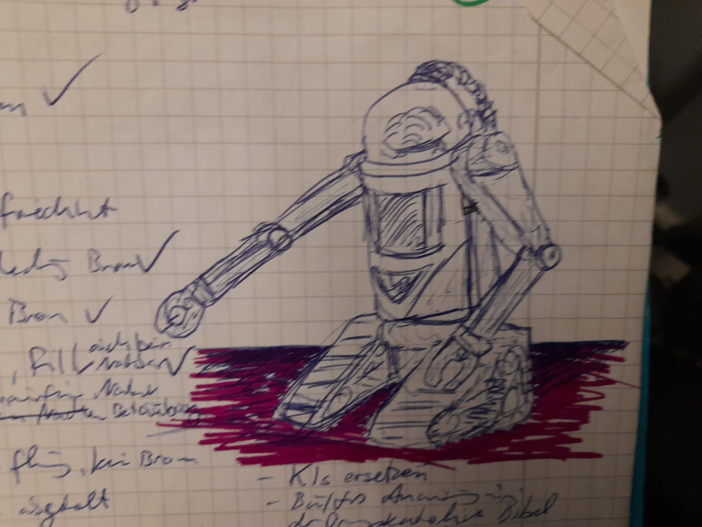

# Technologien

## 📘 Übersicht: Alle Ausrüstungsgegenstände im neuen Codier-Schema

* Schema: [Typ] - [Truppe] - [Merkmale] - [Trageort] - [Modell].[Generation]

### 🟥 Kadetten (K)

| Code         | Ausrüstung             | Bemerkung                                                        |
|--------------|------------------------|------------------------------------------------------------------|
| A-K-S-x-1.1  | Kadettenanzug          | Standardausführung (AK-1), keine integrierte Technik             |
| H-K-S-x-1.1  | Kadettenhelm           | Glashelm, einfache Schutzklasse                                  |
| H-K-V-x-3.1  | Kadettenhelm           | Vollschutzmodell für Ausseneinsätze                              |
| T-K-S-B-1.1	 | Funkmodul (Brustmodul) | sendet nicht selbst, verbunden mit Funkkiste                     |
| T-K-S-R-1.2  | unkkiste FK-2M         | schweres Gruppenfunkgerät, rückentragbar                         |
| F-K-I-O-1.5	 | Filter                 | Filtereinheit für Ausseneinsätze, IN-kompatibel, extern sichtbar |

### 🟦 Piloten (P)

| Code         | Ausrüstung                 | Bemerkung                                          |
|--------------|----------------------------|----------------------------------------------------|
| A-P-x-x-3.1  | 	Pilotenanzug (AP-3 )      | keine eigenen Module, nur strukturell tragend      |
| H-P-N-x-1.1	 | Pilotenhelm nach IN-Norm   | angepasst für Felinen (kein Senden)                |
| L-P-M-H-1.2  | 	Mikrofon-Leichtatmer      | direkt am Helm montiert, Funkweiterleitung an Bord |
| T-P-M-x-1.1	 | Interner Bordfunkanschluss | ohne eigenes Trageelement (Bordintegration)        |

### 🟩 Reguläre Truppe (R)

| Code          | Ausrüstung                   | Bemerkung                                          |
|---------------|------------------------------|----------------------------------------------------|
| A-R-S-x-1.1 	 | Regulärer Bodentrupp-Anzug   | Standard (Platzhalter)                             |
| H-R-S-x-1.1	  | Standardkampfhelm            | für reguläre Truppen, keine Sondermodule           |
| F-R-I-O-1.5	  | Filter (FS-IN-5)             | IN-kompatibel, aussen sichtbar, modular montierbar |
| L-R-S-A-1.3   | 	Standard-Leichtatmer (LS-3) | im Anzug integriert, ohne Mikrofon                 |

### 🟨 Elite (E) (Platzhalter / optional)

| Code          | Ausrüstung   | Bemerkung                                                      |
|---------------|--------------|----------------------------------------------------------------|
| A-E-C-x-4.1   | 	Elite-Anzug | mit erweiterten Funktionen (z. B. Tarnfeld, Kommandostruktur)  |
| H-E-HUD-x-3.1 | 	Elitehelm   | mit Sensorik, HUD-System, taktischer Datenanzeige              |
| T-E-CC-M-2.1  | 	Funkmodul   | für Elite-Kommandoführung, modular andockbar                   |

### 📎 Besondere Hinweise

* Trageort x = nicht definiert / nicht relevant (z. B. bei direkt angezogenen Kleidungsstücken)
* Merkmale sind frei kombinierbar, z.vB. SM, CV, HUDM
* Modular aufgebaute Geräte (z. B. Helm + Leichtatmer) werden immer separat codiert
* Muss aber noch richtig angepasst und formatiert werde nich alles stimmt ao aber das ist mal die grund Idee für ein typenbezeichnungsystem

## Anzug

Draussen brauchst Du immer einen Anzug. Ein Anzug besteht aus:

* Helm
* Anzug mit Brust- und Hinterklett
* Unterzeug
* Halssträmmlung
* Ventil
* Filter
* Stiefel

## Hebroboto

 Ein Arbeitgerät in Form eines Exoskeletts. Es gibt sie in verschiedenen Grössen, je nach auszuführender Arbeit und wie s

## Fernunterhalt

## Barriere-Schiffe

## Nicht-Schiff / Unwahrscheinlichkeits-Tarnung

## Modularfaust

## Entkörperungs-Technologie

## Unwahrscheinlichkeits-Bombe

Geht auf Pluto nieder, Axolotl befallen massiv die Plutonier

## Baumschiff
