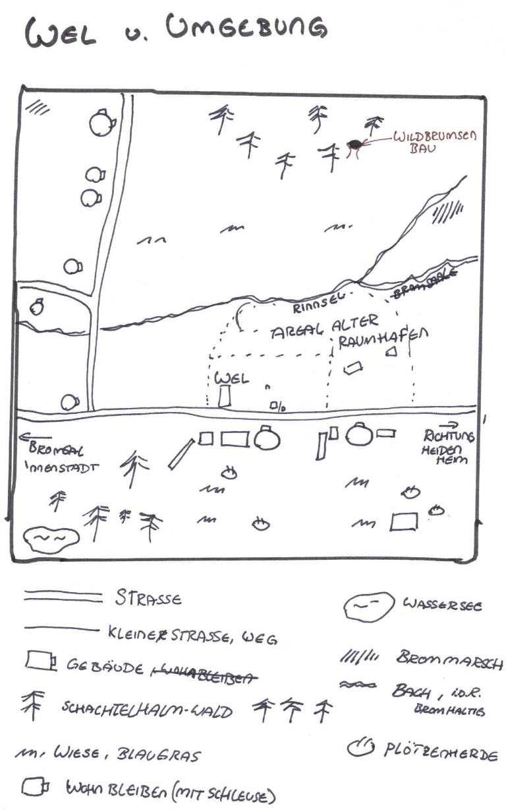

# Karten

## Bromsal und Umgebung

* **Bromsal**
    * mittelgrosse Stadt zwischen Freifahrt und Kruh
    * LastTransport-Gabelung
* **Eichberg** und "**Mildberg**
    * höhere Erhebung zwischen Bromsal und Untergromb
    * Mildberger Tempel auf Spitze des Mildbergs
* **XWel** - Wehrerziehungslager
* **Tunnel**
    * zwischen Bromsal und Haidenhain
    * dunkel
    * Flittermolche und Gallertkrabben
    * zwei Leuchtglobi an der Decke
    * der Weg ist holprig

## Wehrerziehungslager und Umgebung

* **Wehrerzieungslager**: grosses Gelände auf Teilen des ehemaligen Raumhafens
* **Bauernhöfe** (in südlicher Richtung)
    * Hof von Krop Orbs Eltern: Ein aus Blechteilen zusammengeschweißter Bauernhof mit rötlicher Schutzlackierung. Im Hof wachsen Marswurzeln aus künstlich bewässerten Rillen. Über allem liegt ein bronzefarbener Solarschirm. Ein Generator surrt freundlich.
    * Hof von Brul Eryns Eltern: Hellgelber Anbau an einem alten Frachtcontainer. In den Fenstern hängen blaue Tücher. Zwei klapprige Drohnen kreisen über kleinen Tiergehegen aus Netzstoff. Die Erde hier ist heller, fast sandweiß – ungewöhnlich für die Gegend.
* **Plötzenweide** (in südlicher Richtung): Ein flacher Krater mit grün-grauen Futterstreifen. Die Plötzen sind plump und kuhartig, mit schimmernden Häuten in Violett, Beige oder Hellblau. Ihr Sekret tropft in tiefe Auffangschalen aus gebürstetem Stahl. In der Ferne stehen Windtürme, die surren wie Insekten.



