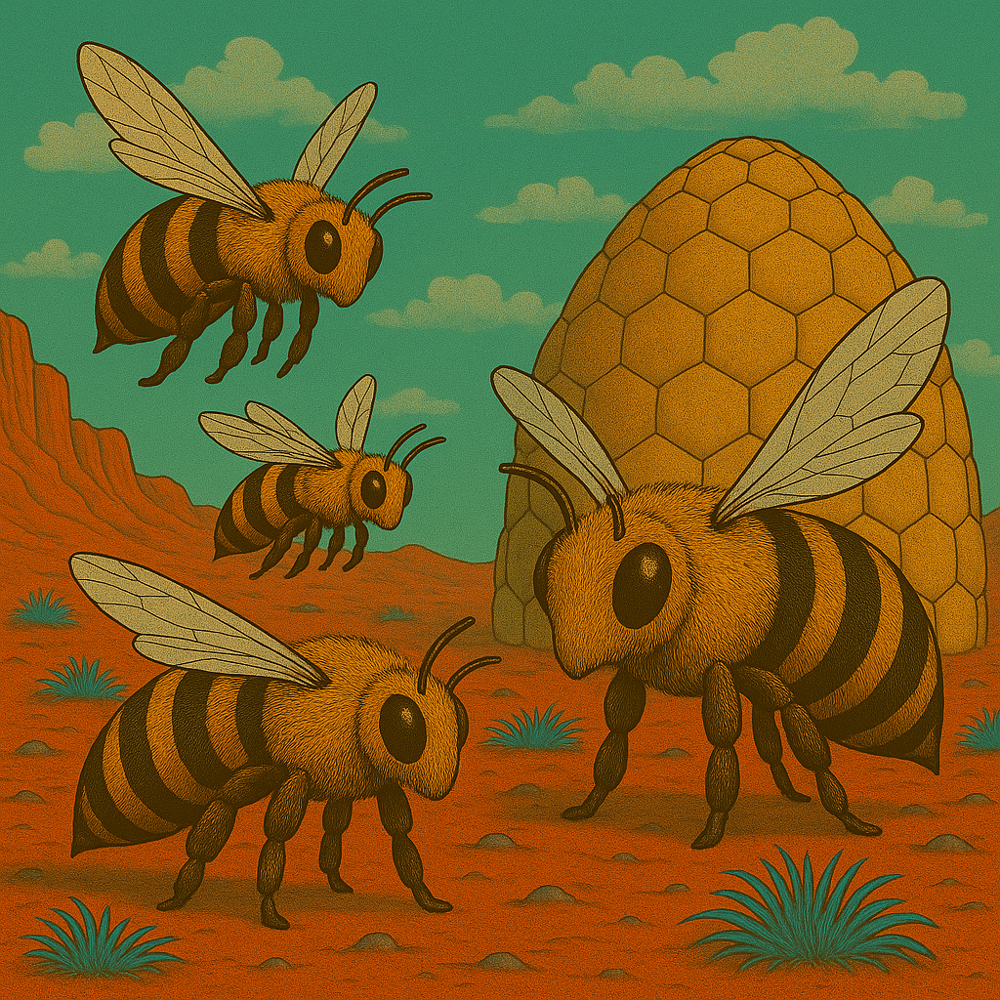
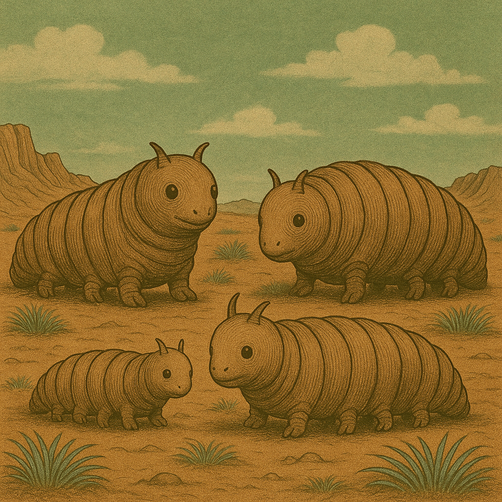

# Die Welt

* Mars, verseucht von Brom
* Feline Lebewesen leben dort, etwa einen Schritt gross
* alle mit Helm und Anzug, die mehr oder weniger in Schuss sind
* es herrscht Krieg im Sonnensystem
* 1 Schritt = 1 Meter

## Mars - Kurzbeschreibung

* Der Rote Planet
* Der Mars ist der zweite Planet zur Sonne, auch genannt der rote Planet. Und er ist über und über voller Brom.
* Der Mars kennt warme und kalte Jahreszeiten. Letztere wird angekündigt durch den sog. Bromsturz, eine Zeit des
  Sturms und bromgetränkten Winden.

## Kulturschaffende

Feline Wesen, die sich selbst "Marser" nennen.

## Zeitrechnung

* Dezimales System
* 1 Sol = 10 Stunden → 100 Minuten → 100 Sekunden
* Marsjahr = 10 Monate à ~66–67 Sols
* also sehr einfach zu rechnen! (für Terraner möglicherweise ungewohnt)

## Zählen

Auf dem Mars wird regelmässig gezählt: erst der Zehner, dann der einer, also:

* 10 zehn
* 11 zehn-und-eins
* 12 zehn-und-zwei
* 13 zehn-und-drei
* 23 zwanzig-und-drei
* 57 fünfzig-und-sieben
* 373759 dreihundert-siebzig-und-drei-tausend-siebenhundert-fünfzig-und-neun

Marser sind daher auch gut im Kopfrechnen, weil die Zahlen geordnet sind.

## Fauna

### Brumsen

### Plötzen

### Flittermolche

* legen Eier, bevorzugt auf Leichen und Kadaverb
* Flittermolch-Maden sind eklig

### Weitere

* Brumsen
* Molche
* Gallertkrabben
* Plötzen
* Echsenschupps
* Streitschupps
* Flieder
* Käfer
* Wasserfische

## Fauna

* Jerrybäume
* Schachtelhalme
* Pilze
* Blaugras
