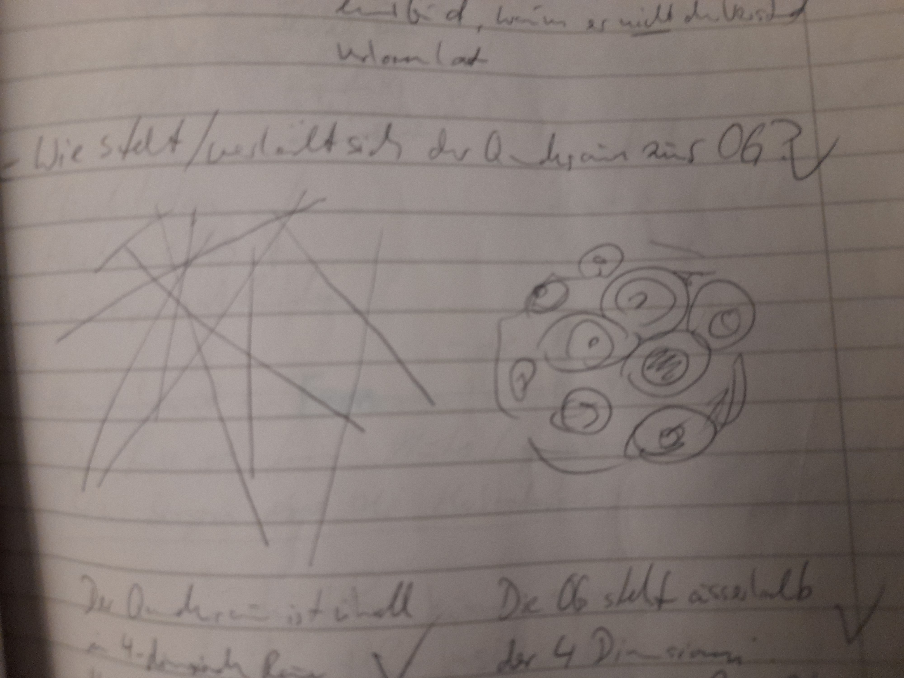

# Quantenraum

## Sonnensystem und Quantenraum

Der Quantenraum, der das gesamte bekannte Universum durchzieht, ist schwarz. Nand kann in diesen hineinblicken.

Durch den Quantenraum verlaufen unzählige helle Fäden, Realitätenfäden, die in unterschiedliche Ausformungen des Universums führen.

Auf Interaktion im und mit dem Quantenraum gehen die göttlichen Wunder zurück: Gegenwartsbrechung und Raumbeugung.

## Oberfäche Gottes

Befindet sich in einer anderen Dimension.

Teile bzw. Scherben der Oberfläche Gottes kamen durch die zwei Unwahrscheinlichkeits-Ereignisse in das Sonnensystem.

